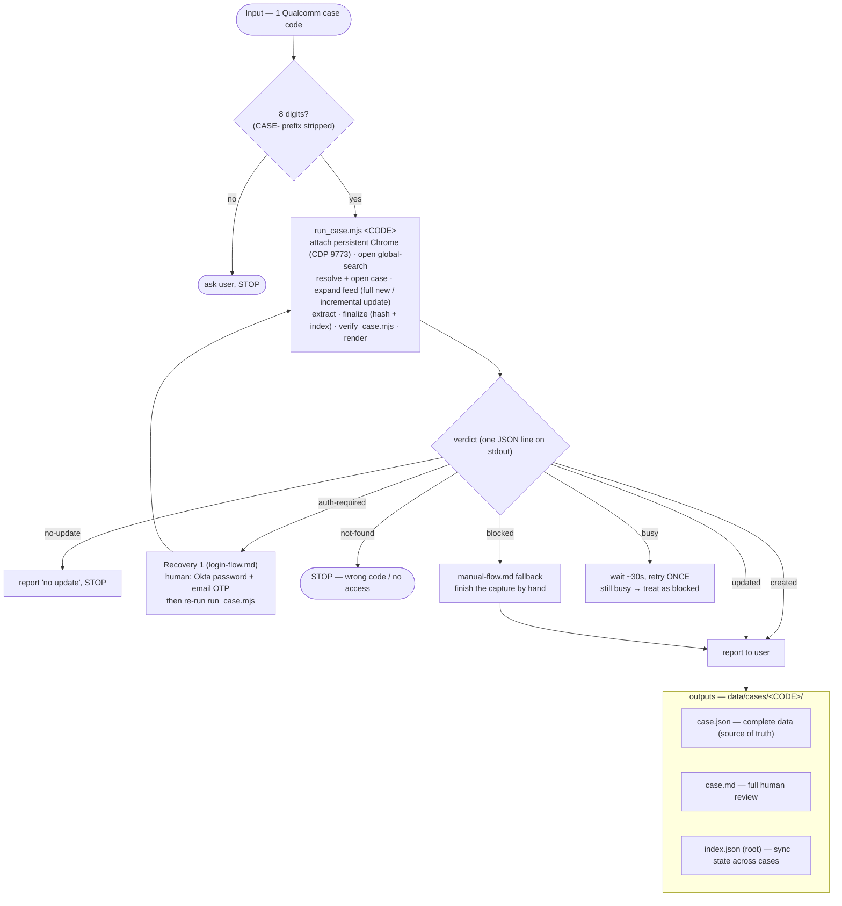

# Workflow — input, processing, output — reference

How the Qualcomm Case Management Agent runs end to end. Companion to `SKILL.md` (phase detail),
`login-flow.md` (auth) and `manual-flow.md` (hand-driven fallback + selector/extraction detail).

**Capture is one command, not an interactive script.** A valid 8-digit code goes straight to
`run_case.mjs` — no "update from portal?" question, no confirmation step. The cache decides
new-vs-update on its own; the model only sees the verdict line.

## Flow

## Input

One Qualcomm case code — exactly 8 digits, `CASE-` prefix accepted and stripped. Anything else →
ask the user, STOP. A valid code never triggers a confirmation prompt.

## Processing (per phase)

| Phase | Does | Guard / branch |
|-------|------|----------------|
| Capture (`run_case.mjs`) | attach persistent-profile Chrome · locate case via global-search · expand feed (full for a new case, only down to the newest cached comment for an update) · extract · finalize with hash + index · self-verify (`verify_case.mjs`) · render | one JSON verdict line on stdout — see status table below |
| Report | `render_case.mjs` → tell user counts (captured vs displayed), file paths | `no-update` skips straight to "no update", STOP |

## Verdict statuses (`run_case.mjs` stdout)

| `status` | exit | Meaning | Next step |
|----------|------|---------|-----------|
| `created` | 0 | new case captured | report to user |
| `updated` | 0 | new comments merged | report to user |
| `no-update` | 0 | nothing new since last capture | "no update", STOP |
| `auth-required` | 3 | saved Okta session lapsed | human manual login (`references/login-flow.md`), then re-run |
| `not-found` | 4 | search returned nothing | STOP |
| `blocked` | 5 | page never rendered / capture short | `references/manual-flow.md` fallback |
| `busy` | 6 | another capture holds the lock | wait ~30s, retry once; still busy → treat as blocked |
| `error` | 1 | bad invocation / script failure | fix per `reason`, don't retry blindly |

## Output (per-case folder `data/cases/<CODE>/`)

| File | Producer | Purpose |
|------|----------|---------|
| `case.json` | `run_case.mjs` (capture) | complete verbatim data — **source of truth** |
| `case.md` | `render_case.mjs` | full render for human review |
| `_index.json` (root) | `scrape_case.mjs` | `<CODE> → {syncedAt, commentCount, hash}` for incremental sync |
| `chrome-profile/` | real Chrome `--user-data-dir` | persistent auth profile (one-time login) |

## Logic backbone

1. **Session > password** — log in once, reuse the Chrome `--user-data-dir` (real Chrome via CDP);
   email OTP only when the session lapses, and only ever entered by the human.
2. **One command, no ask** — a valid code always runs; the script itself decides new-vs-update from
   `_index.json`.
3. **Expand + count assert** — accessibility-tree clicks reveal every post/reply/body; the
   `displayedCommentCount` assert guarantees nothing is missed or truncated before persisting.
4. **Incremental** — an update run expands/extracts ONLY the new comments (`--merge` prepends them,
   everything cached is kept verbatim) and re-renders the output; an unchanged case is not
   rewritten.
5. **Role split** — the script owns capture + persistence (deterministic, token-cheap); the agent
   reports the verdict to the user.
6. **Fail-fast guards** — every non-`created`/`updated`/`no-update` verdict names its own recovery
   path; never guess credentials, never fabricate data.
