# Workflow — Input, Processing, Output — Reference

How the Qualcomm Case Summary functionality in `qcomm` runs end to end. Companion to `SKILL.md` and `docs/adr/0002-case-summary-as-separate-skill.md`.

**Two script steps, agent judgment in between.** Everything mechanical (ensuring capture, computing comment deltas, merging JSON, rendering Markdown) is handled by deterministic scripts. The technical summarization and case flow narrative update are produced by the agent in a single model pass.

---

## 1. Flow Diagram

```mermaid
flowchart TD
    User(["Input — 1 Qualcomm case code (e.g. 08642051)"]) --> VALID{"8 digits?<br/>(CASE- prefix stripped)"}
    VALID -->|"no"| S0(["ask user, STOP"])
    
    VALID -->|"yes"| STEP1["Step 1 (CLI): run_summary.mjs prepare &lt;CODE&gt;"]
    
    subgraph S1_ENGINE ["Step 1 Engine (Deterministic)"]
        STEP1 --> CAP["deps.mjs: captureCase(&lt;CODE&gt;)<br/>calls qcomm (run_case.mjs)"]
        CAP --> CAP_CHECK{"Capture verdict?"}
        CAP_CHECK -->|"auth-required / not-found / blocked / busy / error"| CAP_ABORT["Return capture verdict as-is"]
        CAP_CHECK -->|"created / updated / no-update"| READ_CACHE["Read case.json & summary.json (if exists)"]
        READ_CACHE --> DELTA["delta.mjs: computeDelta()<br/>Set difference on comment IDs"]
        DELTA --> DELTA_CHECK{"delta.length > 0?"}
        DELTA_CHECK -->|"no (0 new comments)"| OUT_NODELTA["Return status: 'no-delta'<br/>+ cached summary + fresh caseStatus"]
        DELTA_CHECK -->|"yes (new comments)"| CAP_APPLY["cap.mjs: applyCharCapToComments (max 20k chars/comment)"]
        CAP_APPLY --> OUT_NEEDS["Return status: 'needs-summary'<br/>+ deltaComments + priorFlow + caseStatus"]
    end
    
    CAP_ABORT --> REPORT_CAP_ERR(["Surface capture recovery/error, STOP"])
    
    OUT_NODELTA --> REPORT_CACHED(["Report caseStatus + cached summary to user<br/>(Cost: 0 model tokens), STOP"])
    
    OUT_NEEDS --> STEP2["Step 2 (LLM Pass): Agent Summarization"]
    
    subgraph S2_AGENT ["Step 2 Agent Judgment (Single-Pass)"]
        STEP2 --> SUM_COMMENTS["Summarize each comment in deltaComments:<br/>- kind / summary / impact / owner / nextAction / references"]
        SUM_COMMENTS --> UPD_FLOW["Update case flow narrative (incremental based on priorFlow)"]
        UPD_FLOW --> WRITE_TEMP["Build payload in agent context<br/>{ comments: [...], flow: '...', executive: {...} }"]
    end
    
    WRITE_TEMP -->|"recommended"| STEP3["Step 3 (CLI): run_summary.mjs &lt;CODE&gt; --payload '&lt;json&gt;'<br/>(single-step: reruns prepare + finalizes)"]
    WRITE_TEMP -.->|"legacy, file-only"| STEP3ALT["write .summary_temp.json,<br/>then: run_summary.mjs finalize &lt;CODE&gt; --input &lt;file.json&gt;"]
    STEP3ALT -.-> STEP3
    
    subgraph S3_FINALIZER ["Step 3 Finalizer (Deterministic)"]
        STEP3 --> MERGE["merge.mjs: mergeSummary()<br/>insertCommentsByParent(): nests new comments into prior's<br/>tree by parentId, oldest-first at every level (#233-#236);<br/>updates flow, status, metadata & executive"]
        MERGE --> W_JSON["Write: data/cases/&lt;CODE&gt;/summary.json"]
        W_JSON --> RENDER["render_summary.mjs: renderSummaryMd()<br/>Format oldest-first presentation"]
        RENDER --> W_MD["Write: data/cases/&lt;CODE&gt;/summary.md"]
        W_MD --> OUT_FINAL["Return status: 'summarized'<br/>{ summaryPath, mdPath, newCount }"]
    end
    
    OUT_FINAL --> REPORT_USER(["Report to User: Case Status + Flow narrative + Newest comment summaries"])
```

`STEP3ALT` is the legacy two-phase path: the agent writes the payload to a temp file itself and calls `finalize --input <file.json>`, which only accepts a file path (no `--payload`/stdin). Both paths merge through the same `mergeSummary()`.

---

## 2. Step-by-Step Breakdown

### Step 0: Intake & Validation
- **Input Contract**: Exactly 8 digits (e.g. `08642051`). Optional `CASE-` prefix is stripped.
- **Immediate Execution**: Valid code proceeds straight to Step 1 without interactive confirmation.

### Step 1: Prepare (`run_summary.mjs prepare <CODE>`)
- Calls `qcomm` via `deps.captureCase` to guarantee local `case.json` is fresh.
- Computes `deltaComments = case.comments.filter(c => !prior.summarizedCommentIds.includes(c.id))`.
- **Branching**:
  - `status: "no-delta"`: No new comments. Returns current `caseStatus` and existing summary. **0 model tokens used**.
  - `status: "needs-summary"`: Returns new comments with a 20,000 character safety cap (`cap.mjs`), `priorFlow`, and `caseStatus`.
  - Capture failures (`auth-required`, `blocked`, etc.): Passthrough verdict to guide user/agent recovery.

### Step 2: Agent Summarization (Model Pass)
- Run within the active agent session for the `deltaComments` batch in one pass:
  - Produces per-comment digest: `id`, `timestamp`, `author`, `kind`, `summary`, `impact`, `owner`, `nextAction`, `references` (as applicable).
  - Updates the `flow` narrative incrementally using `priorFlow` as context.
  - Optionally produces an `executive` object (`ballInCourt`, `blockerOrNextMilestone`, `rootCause`, `resolution`) — a standup-ready snapshot, updated incrementally like `flow`.
- Holds the payload `{ comments: [...], flow: "...", executive: {...} }` in agent context; `executive` is optional. No scratch file is required for the recommended path — only the legacy path below writes one.

### Step 3: Finalize
- **Recommended, single CLI call**: `run_summary.mjs <CODE> --payload '<json>'` (or `--input <file.json>`, or pipe JSON on stdin). This reruns `prepare` internally and finalizes in one process — no intermediate file needed.
- **Legacy, two-phase**: agent writes the payload to `data/cases/<CODE>/.summary_temp.json` itself, then runs `run_summary.mjs finalize <CODE> --input <file.json>`. The `finalize` subcommand only accepts `--input <file.json>` — no `--payload` string and no stdin.
- Both paths merge via `mergeSummary()` → `insertCommentsByParent()`: rebuilds the nested comment tree from `case.json`'s `parentIdOf`/`commentOrder`, nests each new digest under its parent (or top-level if unresolved), oldest-first at every level (#233-#236) — prior comment summaries are untouched, new ones are inserted into the tree, not appended flat.
- Also carries `title`/`url`/`priority`/`product` through from `case.json` (no agent involvement — read directly by the orchestrator) and updates `executive` when the Step 2 payload includes one; a field missing from either source falls back to the prior merged value.
- Persists structured `summary.json`.
- Renders human-readable `summary.md` in **Oldest-First**, hierarchically-numbered order (mirrors `case.json`), with a case metadata header and optional `## Executive Summary` section above `## Case Flow`.

### Step 4: User Reporting
- Outputs:
  1. **Case Status** (verbatim from Qualcomm portal).
  2. **Case Flow Narrative**.
  3. **Recent Comment Summaries** (with a link to `data/cases/<CODE>/summary.md`).

---

## 3. Output Artifacts (`data/cases/<CODE>/`)

| File | Owner | Format / Ordering | Purpose |
|:---|:---|:---|:---|
| `summary.json` | `qcomm` | JSON · Canonical storage | Structured summaries, comment IDs, flow narrative, and metadata |
| `summary.md` | `qcomm` | Markdown · **Oldest-First**, hierarchical numbering | Quick technical digestion for engineers |
| `case.json` | `qcomm` | JSON · **Oldest-First**, nested tree (`subs`) | Read-only input source of truth |

---

## 4. Architectural Invariants

1. **Downstream Read-Only Consumer**: Never mutates `case.json`, `_index.json`, or the capture pipeline.
2. **Deterministic Mechanics, Model for Judgment**: Script manages filesystem, delta, and formatting; LLM is used only for synthesizing technical meaning.
3. **Delta Efficiency**: Unchanged cases cost 0 model calls; updated cases process only unsummarized comments.
4. **Ordering**: `case.json` and `summary.json`/`summary.md` are oldest-first, nested-tree at every level (top-level and each comment's `subs`) — reverted from a 2026-08-27 newest-first experiment, closed out by #233-#236 (ADR 0002 Addendum).
