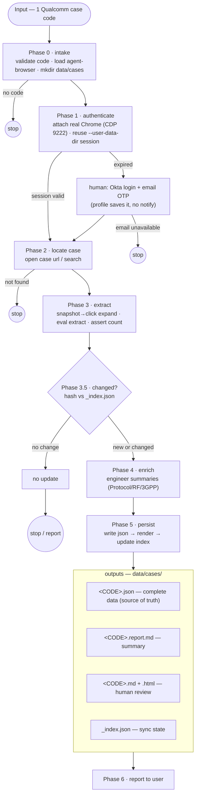

# Workflow — input, processing, output — reference

How the Qualcomm Case Management Agent runs end to end. Companion to `SKILL.md` (phase detail),
`login-flow.md` (auth) and `extraction.md` (expand + extract). A self-contained diagram is in
`workflow.svg` (open in a browser).

## Flow

## Input

One Qualcomm case code (`CASE-01234567`, `00123456`, or the numeric url id). Missing → ask, STOP.

## Processing (per phase)

| Phase | Does | Guard / branch |
|-------|------|----------------|
| 0 Intake | validate+normalize code, load `agent-browser` skill, ensure `data/cases/` | no code → STOP |
| 1 Authenticate | launch real Chrome (`connect_chrome.ps1`, CDP 9222) + attach; reuse persistent `--user-data-dir` (`data/chrome-profile/`); valid → continue | expired → human Okta login + **email OTP** (profile saves it, no notify). **Email unreachable → STOP** |
| 2 Locate | open the case (url / dashboard search on `support.qualcomm.com`) | not found → STOP |
| 3 Extract | **expand via `agent-browser snapshot → click`** ("View More Posts", every "Expand Post", "Description") to no-expanders-left; then ONE `eval` extractor → raw JSON → `scrape_case.mjs` finalizes (assert `comments.length >= displayedCommentCount`, hash, write) | count short → expand more / fix extractor / progressive scroll |
| 3.5 Incremental | SHA-256 the raw case; compare to `_index.json` | same hash → **no update → STOP** (skip enrich + writes) |
| 4 Enrich | per-comment `summary`; case `engineerSummary`, `rootCause`, `recommendedActions`, `tags`, `timeline` | — |
| 5 Persist | write `<CODE>.json` → `node render_case.mjs` → emit report/md/html → update `_index.json` | — |
| 6 Report | tell user: counts (captured vs displayed), root cause, paths | — |

## Output (`data/cases/`)

| File | Producer | Purpose |
|------|----------|---------|
| `<CODE>.json` | model | complete verbatim data + enrichment — **source of truth** |
| `<CODE>.report.md` | `render_case.mjs` | concise summary report |
| `<CODE>.md` + `<CODE>.html` | `render_case.mjs` | full render for human review |
| `_index.json` | model | `<CODE> → {syncedAt, commentCount, hash}` for incremental sync |
| `chrome-profile/` | real Chrome `--user-data-dir` | persistent auth profile (one-time login) |

## Logic backbone

1. **Session > password** — log in once, reuse the Chrome `--user-data-dir` (real Chrome via CDP); OTP only when it expires.
2. **Snapshot→click expand + count assert** — accessibility-tree clicks reveal every post/reply/body;
   the `displayedCommentCount` assert guarantees nothing is missed or truncated.
3. **Incremental** — unchanged case is not re-enriched or rewritten.
4. **Role split** — model owns data + judgement (JSON); the render script owns formatting
   (report/md/html) → deterministic and token-cheap.
5. **Fail-fast guards** — four early STOPs (no code, email unavailable, not found, no change);
   never guess credentials, never fabricate data.
