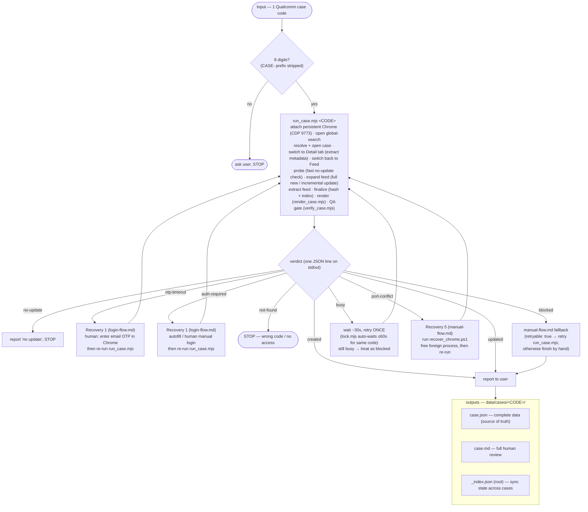

# Workflow — input, processing, output — reference

How the Qualcomm Case Management Agent runs end to end. Companion to `SKILL.md` (phase detail),
`login-flow.md` (auth) and `manual-flow.md` (hand-driven fallback + selector/extraction detail).

**Capture is one command, not an interactive script.** A valid 8-digit code goes straight to
`run_case.mjs` — no "update from portal?" question, no confirmation step. The cache decides
new-vs-update on its own; the model only sees the verdict line.

## Flow

```mermaid
flowchart TD
  IN(["Input — 1 Qualcomm case code"]) --> VALID{"8 digits?<br/>(CASE- prefix stripped)"}
  VALID -->|no| S0(["ask user, STOP"])
  VALID -->|yes| RUN["run_case.mjs &lt;CODE&gt;<br/>attach persistent Chrome (CDP 9773) · open global-search<br/>resolve + open case · switch to Detail tab (extract metadata) · switch back to Feed<br/>probe (fast no-update check) · expand feed (full new / incremental update)<br/>extract feed · finalize (hash + index) · render (render_case.mjs) · QA gate (verify_case.mjs)"]
  RUN --> V{"verdict (one JSON line on stdout)"}
  V -->|created| REPORT["report to user"]
  V -->|updated| REPORT
  V -->|no-update| REPORT_NU["report 'no update', STOP"]
  V -->|otp-timeout| OTP["Recovery 1 (login-flow.md)<br/>human: enter email OTP in Chrome<br/>then re-run run_case.mjs"]
  V -->|auth-required| AUTH["Recovery 1 (login-flow.md)<br/>autofill / human manual login<br/>then re-run run_case.mjs"]
  V -->|not-found| S1(["STOP — wrong code / no access"])
  V -->|blocked| MANUAL["manual-flow.md fallback<br/>(retryable: true → retry run_case.mjs;<br/>otherwise finish by hand)"]
  V -->|busy| RETRY["wait ~30s, retry ONCE<br/>(lock.mjs auto-waits &le;60s for same code)<br/>still busy → treat as blocked"]
  V -->|port-conflict| PORT["Recovery 5 (manual-flow.md)<br/>run recover_chrome.ps1<br/>free foreign process, then re-run"]
  OTP --> RUN
  AUTH --> RUN
  PORT --> RUN
  RETRY --> RUN
  MANUAL --> REPORT
  REPORT --> OUT
  subgraph OUT["outputs — data/cases/&lt;CODE&gt;/"]
    O1["case.json — complete data (source of truth)"]
    O2["case.md — full human review"]
    O3["_index.json (root) — sync state across cases"]
  end
```

## Input

One Qualcomm case code — exactly 8 digits, `CASE-` prefix accepted and stripped. Anything else →
ask the user, STOP. A valid code never triggers a confirmation prompt.

## Processing (per phase)

| Phase | Does | Guard / branch |
|-------|------|----------------|
| Pre-flight | Validate code (8 digits), check credentials (`data/.secrets/qid.bin` + username), acquire lock (`lock.mjs`, auto-wait up to 60s if same case code) | Missing credentials → exit 1 (`error`); lock busy → exit 6 (`busy`) |
| Capture (`run_case.mjs`) | Attach persistent-profile Chrome (CDP 9773) · locate case via global search / direct URL · switch to Detail tab to extract Salesforce metadata (`extract_case.js`) · switch back to Feed tab · probe feed (fast no-update check) · expand Chatter feed (full for a new case, down to newest cached anchor for an update) · extract feed (`extract_case.js`) and merge Detail metadata · finalize with hash + index (`finalize_case.mjs`) · render (`render_case.mjs`) · self-verify QA gate (`verify_case.mjs`) | One JSON verdict line on stdout — see status table below |
| Report | `render_case.mjs` → tell user counts (captured vs displayed), file paths | `no-update` skips straight to "no update", STOP |

## Verdict statuses (`run_case.mjs` stdout)

| `status` | exit | Meaning | Next step |
|----------|------|---------|-----------|
| `created` | 0 | new case captured | report to user |
| `updated` | 0 | new comments merged | report to user |
| `no-update` | 0 | nothing new since last capture | "no update", STOP |
| `otp-timeout` | 2 | password autofilled, but OTP timed out | human enters OTP in open Chrome window (`references/login-flow.md` / `manual-flow.md` Recovery 1), then re-run — no need to redo password |
| `auth-required` | 3 | saved Okta session lapsed (autofill retries exhausted or manual login needed) | finish login in open Chrome window (`references/login-flow.md` Recovery 1), then re-run |
| `not-found` | 4 | search returned nothing | STOP — wrong code or account lacks access |
| `blocked` | 5 | page never rendered / capture short / gate failed | if `retryable: true` (e.g. transient expand or verify glitch), retry `run_case.mjs`; otherwise `references/manual-flow.md` fallback |
| `busy` | 6 | another capture holds the lock (`lock.mjs` auto-waited up to 60s for same code; returns immediately for different code) | wait ~30s, retry once; still busy → treat as blocked (`references/manual-flow.md` Recovery 4) |
| `port-conflict` | 7 | CDP port held by non-project Chrome or foreign process | run `recover_chrome.ps1` (`references/manual-flow.md` Recovery 5) to inspect/free port; never auto-killed |
| `error` | 1 | bad invocation, missing credentials, or script failure | fix per `reason` (e.g. `npm run setup:credentials`), don't retry blindly |

## Output (per-case folder `data/cases/<CODE>/`)

| File | Producer | Purpose |
|------|----------|---------|
| `case.json` | `run_case.mjs` (capture) | complete verbatim data — **source of truth** |
| `case.md` | `render_case.mjs` | full render for human review |
| `_index.json` (root) | `finalize_case.mjs` | `<CODE> → {syncedAt, commentCount, hash}` for incremental sync |
| `chrome-profile/` | real Chrome `--user-data-dir` | persistent auth profile (one-time login) |

## Logic backbone

1. **Session > password** — log in once, reuse the Chrome `--user-data-dir` (real Chrome via CDP);
   email OTP only when the session lapses, and only ever entered by the human.
2. **One command, no ask** — a valid code always runs; the script itself decides new-vs-update from
   `_index.json`.
3. **Detail tab before Feed** — metadata fields (`contactName`, `openedAt`, `status`, etc.) are extracted
   first by switching to the Salesforce Detail tab via `switch_tab.js`, before switching back to the
   Feed tab to probe and expand Chatter posts.
4. **Expand + count assert** — accessibility-tree clicks reveal every post/reply/body; the
   `displayedCommentCount` assert guarantees nothing is missed or truncated before persisting.
5. **Render before QA verification** — `render_case.mjs` writes `case.md` immediately after
   `finalize_case.mjs` writes `case.json`; `verify_case.mjs` then inspects both persisted artifacts
   as the final QA gate before returning success.
6. **Incremental** — an update run expands/extracts ONLY the new comments (`--merge` prepends them,
   everything cached is kept verbatim) and re-renders the output; an unchanged case is not
   rewritten.
7. **Lock-based concurrency** — single capture lock (`data/.capture.lock` via `lock.mjs`).
   `acquireLockOrWaitForSameCode` automatically waits and polls up to 60s for an in-flight capture
   of the *same* case code to complete; different-case collisions return `busy` (exit 6) immediately.
8. **Role split** — the script owns capture + persistence (deterministic, token-cheap); the agent
   reports the verdict to the user.
9. **Fail-fast guards** — every non-`created`/`updated`/`no-update` verdict names its own recovery
   path (with `retryable: true` marking transient glitches); never guess credentials, never fabricate data.
