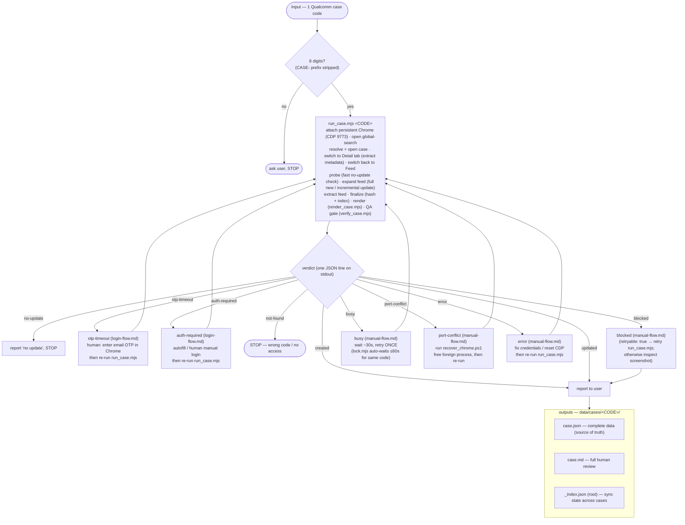

# Workflow — Architecture, Data Flow & Concurrency Reference

End-to-end execution and architectural reference for the Qualcomm Case Management Agent. Companion to [`SKILL.md`](../SKILL.md) (authoritative execution contract), [`login-flow.md`](login-flow.md) (authentication lifecycle), and [`manual-flow.md`](manual-flow.md) (recovery runbooks).

**Deterministic fast-path:** A valid 8-digit case code routes directly to `run_case.mjs` without interactive prompts. The local cache determines whether full capture or incremental synchronization is required, and stdout yields exactly one JSON verdict line.

## Architecture & Data Flow

```mermaid
flowchart TD
  IN(["Input — 1 Qualcomm case code"]) --> VALID{"8 digits?<br/>(CASE- prefix stripped)"}
  VALID -->|no| S0(["ask user, STOP"])
  VALID -->|yes| RUN["run_case.mjs &lt;CODE&gt;<br/>attach persistent Chrome (CDP 9773) · open global-search<br/>resolve + open case · switch to Detail tab (extract metadata) · switch back to Feed<br/>probe (fast no-update check) · expand feed (full new / incremental update)<br/>extract feed · finalize (hash + index) · render (render_case.mjs) · QA gate (verify_case.mjs)"]
  RUN --> V{"verdict (one JSON line on stdout)"}
  V -->|created| REPORT["report to user"]
  V -->|updated| REPORT
  V -->|no-update| REPORT_NU["report 'no update', STOP"]
  V -->|otp-timeout| OTP["otp-timeout (login-flow.md)<br/>human: enter email OTP in Chrome<br/>then re-run run_case.mjs"]
  V -->|auth-required| AUTH["auth-required (login-flow.md)<br/>autofill / human manual login<br/>then re-run run_case.mjs"]
  V -->|not-found| S1(["STOP — wrong code / no access"])
  V -->|blocked| MANUAL["blocked (manual-flow.md)<br/>(retryable: true → retry run_case.mjs;<br/>otherwise inspect screenshot)"]
  V -->|busy| RETRY["busy (manual-flow.md)<br/>wait ~30s, retry ONCE<br/>(lock.mjs auto-waits &le;60s for same code)"]
  V -->|port-conflict| PORT["port-conflict (manual-flow.md)<br/>run recover_chrome.ps1<br/>free foreign process, then re-run"]
  V -->|error| ERR["error (manual-flow.md)<br/>fix credentials / reset CDP<br/>then re-run run_case.mjs"]
  OTP --> RUN
  AUTH --> RUN
  PORT --> RUN
  RETRY --> RUN
  ERR --> RUN
  MANUAL --> REPORT
  REPORT --> OUT
  subgraph OUT["outputs — data/cases/&lt;CODE&gt;/"]
    O1["case.json — complete data (source of truth)"]
    O2["case.md — full human review"]
    O3["_index.json (root) — sync state across cases"]
  end
```

## Input Contract

Exactly one 8-digit numeric Qualcomm case code (e.g. `08460319`). The optional `CASE-` prefix is automatically stripped. Invalid inputs prompt the user for a valid code and halt execution.

## Processing Phases

| Phase | Operation | Guard / Branch Contract |
|-------|-----------|-------------------------|
| **Pre-flight** | Validate 8-digit code, verify DPAPI credentials (`data/.secrets/qid.bin` + username), acquire capture lock (`lock.mjs`, auto-polling up to 60s for identical case code). | Missing credentials → exit 1 (`error`); lock busy → exit 6 (`busy`). |
| **Capture (`run_case.mjs`)** | Attach persistent-profile Chrome (CDP 9773) · locate case via global search / cached direct URL · switch to Detail tab to extract Salesforce metadata (`extract_case.js`) · switch back to Feed tab · probe feed (fast no-update check) · expand Chatter feed (full for new cases, down to newest cached anchor for updates) · extract feed (`extract_case.js`) and merge Detail metadata · finalize with SHA-256 hash + index (`finalize_case.mjs`) · render (`render_case.mjs`) · verify QA invariants (`verify_case.mjs`). | Emits exactly one JSON verdict line on stdout — see authoritative table in [`SKILL.md`](../SKILL.md#step-3--branch-on-json-verdict). |
| **Report** | Parse verdict payload and present case metadata, comment count, and artifact paths to user. | `no-update` delivers unchanged status notification, STOP. |

## Verdict Routing & SSOT

`run_case.mjs` outputs exactly one JSON verdict line on stdout. The authoritative routing table, status definitions, and exit code contracts are defined in [`SKILL.md`](../SKILL.md#step-3--branch-on-json-verdict).

For detailed recovery runbooks on non-zero verdicts (`error`, `otp-timeout`, `auth-required`, `not-found`, `blocked`, `busy`, `port-conflict`), follow [`manual-flow.md`](manual-flow.md) and [`login-flow.md`](login-flow.md).

## Output Artifacts (per-case folder `data/cases/<CODE>/`)

| File | Producer | Purpose |
|------|----------|---------|
| `case.json` | `run_case.mjs` (`finalize_case.mjs`) | Complete structured verbatim data — **canonical machine source of truth** |
| `case.md` | `render_case.mjs` | Full formatted render for human review (newest-first with replies grouped) |
| `_index.json` (root) | `finalize_case.mjs` | Global sync index (`<CODE> → {syncedAt, commentCount, hash}`) for incremental sync |
| `chrome-profile/` | Native Chrome `--user-data-dir` | Persistent authentication profile (reusable session cookies) |

## Concurrency & Architectural Invariants

1. **Session Longevity**: Authenticate once and persist session state in Chrome `--user-data-dir` via CDP port 9773. Email OTP is required only when the portal session lapses, and is entered directly by the human.
2. **Autonomous Execution**: A valid case code executes immediately; `run_case.mjs` determines full capture vs incremental sync automatically from `_index.json`.
3. **Tab Extraction Ordering**: Metadata fields (`contactName`, `openedAt`, `status`, `accountName`, etc.) are extracted first by switching to the Salesforce Detail tab (`switch_tab.js`), then returning to the Feed tab to probe and expand Chatter posts.
4. **Complete Feed Expansion**: Accessibility-tree interactions expand every post, reply, and inline body. The `countAssert` and collapsed-body checks guarantee complete capture before persisting.
5. **Render Before QA Gate**: `render_case.mjs` writes `case.md` immediately after `finalize_case.mjs` writes `case.json`; `verify_case.mjs` subsequently validates both artifacts against structural invariants.
6. **Incremental Merging**: Sync runs expand and extract only newly posted comments, merging them onto cached history while keeping existing comments verbatim.
7. **Machine-Wide Capture Lock**: `lock.mjs` enforces single-process capture via `data/.capture.lock`. `acquireLockOrWaitForSameCode` polls for up to 60s if another process is capturing the *same* case code, resolving contention gracefully once the active capture finishes. Cross-case collisions return `busy` (exit 6) immediately.
8. **Role Boundary**: Node.js scripts own deterministic browser automation and artifact persistence; the agent synthesizes user summaries directly from the JSON verdict payload.
9. **Deterministic Failure Routing**: Non-zero verdicts provide explicit diagnostic metadata (`reason`, `retryable`, `detailSwitchError`) to guide deterministic recovery.
