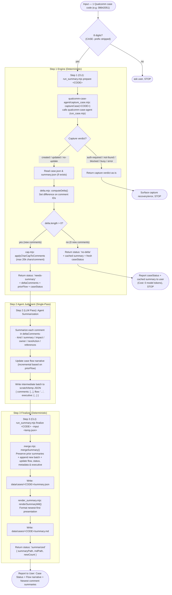

# Workflow — Input, Processing, Output — Reference

How the Qualcomm Case Summary Skill (`qualcomm-case-summary`) runs end to end. Companion to `SKILL.md` and `docs/adr/0002-case-summary-as-separate-skill.md`.

**Two script steps, agent judgment in between.** Everything mechanical (ensuring capture, computing comment deltas, merging JSON, rendering Markdown) is handled by deterministic scripts. The technical summarization and case flow narrative update are produced by the agent in a single model pass.

---

## 1. Flow Diagram

---

## 2. Step-by-Step Breakdown

### Step 0: Intake & Validation
- **Input Contract**: Exactly 8 digits (e.g. `08642051`). Optional `CASE-` prefix is stripped.
- **Immediate Execution**: Valid code proceeds straight to Step 1 without interactive confirmation.

### Step 1: Prepare (`run_summary.mjs prepare <CODE>`)
- Calls `qualcomm-case-agent`'s `captureCase` to guarantee local `case.json` is fresh.
- Computes `deltaComments = case.comments.filter(c => !prior.summarizedCommentIds.includes(c.id))`.
- **Branching**:
  - `status: "no-delta"`: No new comments. Returns current `caseStatus` and existing summary. **0 model tokens used**.
  - `status: "needs-summary"`: Returns new comments with a 20,000 character safety cap (`cap.mjs`), `priorFlow`, and `caseStatus`.
  - Capture failures (`auth-required`, `blocked`, etc.): Passthrough verdict to guide user/agent recovery.

### Step 2: Agent Summarization (Model Pass)
- Run within the active agent session for the `deltaComments` batch in one pass:
  - Produces per-comment digest: `id`, `timestamp`, `author`, `kind`, `summary`, `impact`, `owner`, `nextAction`, `references` (as applicable).
  - Updates the `flow` narrative incrementally using `priorFlow` as context.
  - Optionally produces an `executive` object (`ballInCourt`, `blockerOrNextMilestone`, `rootCause`, `resolution`) — a standup-ready snapshot, updated incrementally like `flow`.
- Saves payload `{ comments: [...], flow: "...", executive: {...} }` into a temporary JSON file (e.g. `temp/summary_<CODE>.json`); `executive` is optional.

### Step 3: Finalize (`run_summary.mjs finalize <CODE> --input <temp.json>`)
- Pure merge via `mergeSummary()`: Preserves previous comment summaries untouched, appends new ones in canonical order, updates `flow`, `status`, and `lastSummarizedAt`.
- Also carries `title`/`url`/`priority`/`product` through from `case.json` (no agent involvement — read directly by the orchestrator) and updates `executive` when the Step 2 payload includes one; a field missing from either source falls back to the prior merged value.
- Persists structured `summary.json`.
- Renders human-readable `summary.md` in **Newest-First** order, with a case metadata header and optional `## Executive Summary` section above `## Case Flow`.

### Step 4: User Reporting
- Outputs:
  1. **Case Status** (verbatim from Qualcomm portal).
  2. **Case Flow Narrative**.
  3. **Recent Comment Summaries** (with a link to `data/cases/<CODE>/summary.md`).

---

## 3. Output Artifacts (`data/cases/<CODE>/`)

| File | Owner | Format / Ordering | Purpose |
|:---|:---|:---|:---|
| `summary.json` | `qualcomm-case-summary` | JSON · Canonical storage | Structured summaries, comment IDs, flow narrative, and metadata |
| `summary.md` | `qualcomm-case-summary` | Markdown · **Newest-First** | Quick technical digestion for engineers |
| `case.json` | `qualcomm-case-agent` | JSON · **Newest-First** (replies grouped under parent) | Read-only input source of truth |

---

## 4. Architectural Invariants

1. **Downstream Read-Only Consumer**: Never mutates `case.json`, `_index.json`, or the capture pipeline.
2. **Deterministic Mechanics, Model for Judgment**: Script manages filesystem, delta, and formatting; LLM is used only for synthesizing technical meaning.
3. **Delta Efficiency**: Unchanged cases cost 0 model calls; updated cases process only unsummarized comments.
4. **Ordering**: `case.json` is newest-first (`orderCommentsForPresentation` — supersedes the original Oldest → Newest design in PRD #105-109); `summary.md` mirrors that newest-first order (ADR 0002, updated).
