# Workflow — Input, Processing, Output — Reference

How the Qualcomm Issue Precedent Skill (`qualcomm-issue-precedent`) runs end to end. Companion to
`SKILL.md` and `docs/adr/0002-case-summary-as-separate-skill.md` (this skill follows the same
read-only-downstream pattern).

**Three script boundaries, agent judgment in between.** Candidate search (#182), verdict synthesis
(#183), and report persistence are each a deterministic CLI. The agent's job is picking which
already-extracted signatures are worth testing, and assembling the final result — never inventing
a signature or a conclusion.

---

## 1. Flow Diagram

```mermaid
flowchart TD
    User(["Input — free-text issue title + repro (no case code)"]) --> STEP1

    STEP1["Step 1 (CLI): precedent_search.mjs &lt;title + repro&gt;"]
    subgraph S1_ENGINE ["Step 1 Engine (Deterministic, #182)"]
        STEP1 --> SCAN["precedent_store.mjs: buildReferenceCaseCorpus()<br/>scans data/cases/, keeps only Cases with summary.json.executive.rootCause"]
        SCAN --> RANK["scoreCandidate(): keyword overlap (title/rootCause &gt; flow) + product soft boost"]
        RANK --> EXTRACT["collectSignatures(): verbatim regex extraction from rootCause/resolution/comments,<br/>each tagged with its source"]
        EXTRACT --> OUT1["Return {status, query, candidates}<br/>candidates: top N, each with signatures[] (possibly empty)"]
    end

    OUT1 --> EMPTY{"candidates empty?"}
    EMPTY -->|"yes"| SKIP2["Skip Step 2/3 for this run"]
    EMPTY -->|"no"| STEP2

    STEP2["Step 2 (Agent Judgment): select signatures to test, per candidate"]
    subgraph S2_AGENT ["Step 2 — Verbatim-Only Selection"]
        STEP2 --> HASSIG{"candidate.signatures empty?"}
        HASSIG -->|"yes"| MARK_INSUFF["Mark candidate: verdict = 'insufficient technical data to check', checks = []<br/>(skip Step 3 for it)"]
        HASSIG -->|"no"| PICK["Pick a subset of candidate.signatures verbatim + a table (signalling/trace) each"]
    end

    PICK --> STEP3["Step 3 (CLI, per candidate): run_precedent.mjs verdict --input &lt;candidate+selections+session&gt;"]
    subgraph S3_ENGINE ["Step 3 Engine (Deterministic, #183)"]
        STEP3 --> VALIDATE["synthesizeVerdict(): reject any selection not verbatim in candidate.signatures"]
        VALIDATE --> QUERY["log_query_client.mjs: queryLogSignature(table, signature, session) per selection<br/>(PLACEHOLDER: always 'unavailable' until #181's log_query.py contract lands)"]
        QUERY --> CLASSIFY["classify each result: matched / unmatched / indeterminate"]
        CLASSIFY --> VERDICT_OUT["verdict = matched known cause | does not match | insufficient technical data to check"]
    end

    VERDICT_OUT --> STEP4
    MARK_INSUFF --> STEP4
    SKIP2 --> STEP4

    STEP4["Step 4 (Agent Judgment): synthesize full result<br/>{issueTitle, issueRepro, query, candidates: [...+selections+verdict+checks]}"]
    STEP4 --> STEP5["Step 5 (CLI): run_precedent.mjs finalize --input &lt;full result&gt;"]

    subgraph S5_ENGINE ["Step 5 Engine (Deterministic)"]
        STEP5 --> RENDER["precedent_report.mjs: renderPrecedentReportMd()"]
        RENDER --> WRITE["Write data/cases/_precedent/&lt;slug&gt;-&lt;timestamp&gt;.md"]
        WRITE --> OUT5["Return {status: 'ok', reportPath}"]
    end

    OUT5 --> REPORT(["Step 6: Report to user — candidates found, verdicts, link to saved report"])
```

---

## 2. Step-by-Step Breakdown

### Step 0: Intake
- **Input Contract**: free-text `title` + `repro` description. No case code — this runs before a
  Qualcomm case may even exist. An optional opaque `session` reference feeds the log cross-check;
  its shape is defined entirely by whatever `log_query.py` eventually expects (see #181), not by
  this skill.

### Step 1: Search (`precedent_search.mjs <query>`)
- Delegates to `precedent_store.mjs`'s `searchPrecedents()`: scans `data/cases/`, keeps only
  Reference Cases (`summary.json.executive.rootCause` non-empty — everything else is excluded from
  the corpus entirely, not merely ranked low), scores by keyword overlap, and extracts verbatim,
  provenance-tagged signatures per candidate.
- `candidates` can be an empty array — a legitimate, reportable outcome, not an error.

### Step 2: Signature Selection (Agent Judgment)
- Operates only on strings already present in a candidate's own `signatures` list. No candidate's
  signature list is ever edited, reworded, or supplemented by the agent.
- A candidate with zero extracted signatures never reaches Step 3 — it is definitionally
  `"insufficient technical data to check"`, per #183's own `synthesizeVerdict` contract.

### Step 3: Verdict (`run_precedent.mjs verdict --input <file.json>`)
- Thin CLI over `precedent_verdict.mjs`'s `synthesizeVerdict()`, which itself is the one place the
  verbatim-selection invariant is enforced (throws, not silently drops, an invented selection).
- Each selection is checked via `log_query_client.mjs`'s `queryLogSignature()` — the sole call site
  for the external `log_query.py` tool. That module is an explicitly-labeled placeholder today
  (issue #181's real contract is pending), so every check currently comes back `unavailable`,
  which classifies as `indeterminate` and drives the verdict to `"insufficient technical data to
  check"` unless another selection for the same candidate already matched.

### Step 4: Synthesis (Agent Judgment)
- Pure assembly: merge each candidate's Step 1 fields with its Step 2 selections and Step 3
  verdict/checks (or the Step 2 `insufficient` default) into one report object. No new claims are
  introduced here — this step never states a root cause or fix beyond what Steps 1-3 already
  produced.

### Step 5: Persist (`run_precedent.mjs finalize --input <file.json>`)
- `precedent_report.mjs` renders the report to Markdown and writes it under
  `data/cases/_precedent/`, creating that directory if needed. The filename is a slug of
  `issueTitle` plus a filesystem-safe timestamp, so repeated runs for the same issue never
  collide or silently overwrite each other.
- This directory is itself excluded from the Step 1 corpus scan (`buildReferenceCaseCorpus` skips
  any `data/cases/` entry starting with `_`), so persisted reports never become precedent
  candidates for a later run.

### Step 6: User Reporting
- Outputs: candidate count + top matches, one verdict line per candidate with its evidence, and a
  link to the saved report file.

---

## 3. Output Artifacts

| File | Owner | Format | Purpose |
|:---|:---|:---|:---|
| `data/cases/_precedent/<slug>-<timestamp>.md` | `qualcomm-issue-precedent` | Markdown | Full precedent-check result: candidates, verdicts, evidence — for the engineer to reference while writing the new issue's RCA. |
| `data/cases/<CODE>/case.json` | `qualcomm-case-agent` | JSON | Read-only input source (candidate title/product/url/comments). |
| `data/cases/<CODE>/summary.json` | `qualcomm-case-summary` | JSON | Read-only input source (candidate rootCause/resolution/flow) — its presence with a non-empty `executive.rootCause` is what makes a Case a Reference Case at all. |

---

## 4. Architectural Invariants

1. **Downstream Read-Only, Additive-Only**: Never mutates `case.json`, `summary.json`,
   `_index.json`, `_overview.json`, or the capture/summary pipelines. The only filesystem write is
   a new file under `data/cases/_precedent/`.
2. **Deterministic Mechanics, Model for Selection/Assembly**: Search, verdict synthesis, and
   persistence are all pure/deterministic CLIs; the LLM only selects which already-extracted
   signatures to test and assembles the final report — it never extracts, scores, or queries
   anything itself.
3. **No Fabrication**: Every signature is verbatim-traceable to a candidate's own stored text
   (#182); every verdict is the output of #183's `log_query` cross-check, never a model guess. No
   step ever generates a root cause or fix.
4. **`log_query.py` Isolation**: `log_query_client.mjs` is the sole call site for the external
   tool. Every other module depends only on its exported `queryLogSignature()` shape, so supplying
   the real contract later means rewriting one file, not the verdict/report logic built here.
