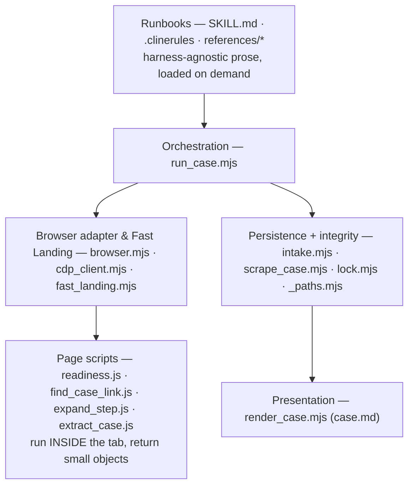
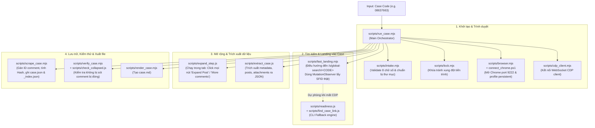
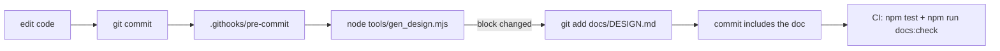

# Design & Architecture — `qualcomm-case-agent`

**Audience:** architecture review, senior/expert developers joining or auditing this pipeline.
**Scope:** the whole repo — the agent skill and the headless capture pipeline. This is a
capture-only tool: given a case code, search the portal, save the data. Nothing else.
**Status:** describes the code at the fingerprint recorded in §7. Sections 1–6 and 8–12 are
hand-written (intent, rationale, trade-offs); §7 is generated from the source on every commit
(see §12).

---

## 1. Problem, constraints, non-goals

### 1.1 The problem

Qualcomm Support (`support.qualcomm.com`) is a Salesforce Lightning portal. A support case is a
Chatter feed: metadata plus an arbitrarily long, paginated, collapsed comment thread carrying the
actual engineering content (symptoms, QXDM logs, 3GPP references, requests for data). Engineers
need two things the portal does not give them:

1. **The complete case offline** — every comment verbatim, not the first page, not a summary.
2. **To know when it changes** — without re-reading a 40-comment thread by hand.

### 1.2 Constraints that shaped every decision

| # | Constraint | Consequence |
|---|---|---|
| C1 | **No API.** The portal exposes no case API to this account; the DOM is the interface. | Browser automation is the only transport. |
| C2 | **Okta SSO with email OTP.** The 6-digit code arrives in a mailbox no automation here can read. | Full unattended auth is *impossible*; the design must degrade to "ask the human once", not retry-loop. |
| C3 | **NDA content.** Case bodies, logs and customer names are confidential. | Cache stays local + git-ignored; nothing is sent to an external service. |
| C4 | **Model tokens are the dominant cost.** The measured baseline was 123k input tokens for one case (flow 1784759542159), almost all of it browser choreography. | Anything deterministic must leave the model's context entirely. |
| C5 | **Windows + PowerShell host, driven by more than one agent harness** (Claude Code, Cline). | No shell-quoted payloads; no bash-only idioms; every step must be a single plain command. |
| C6 | **Fidelity over convenience.** A truncated comment is worse than no comment. | Capture is verbatim; completeness is asserted before persisting. |

### 1.3 Non-goals

- Multi-case capture in one invocation — one case per run.
- Writing back to the portal (read-only by ToS and by design).
- A hosted/multi-user service — this is a single-desktop tool, and C3 keeps it that way.
- Analyzing or summarizing the case — this tool captures; interpretation is left to whoever reads
  `case.json` next.

---

## 2. System context


The trust boundary is the desktop. Nothing leaves it except the authenticated HTTPS session to
Qualcomm.

---

## 3. Architecture

### 3.1 The central decision: **capture is deterministic code, zero model tokens**

This is the load-bearing decision of the whole system. Every step of retrieval — sign in, resolve
the case URL, paginate, expand posts, read the DOM, hash, merge, render — is a *decision-free*
procedure. Driving it turn-by-turn through an agent means dumping a Salesforce accessibility tree
into a model's context dozens of times so it can find one element reference to click. That is C4's
123k tokens, and none of it is reasoning.

So the pipeline is split at the point where judgement would begin:

| Layer | Owner | Cost | Contract |
|---|---|---|---|
| Retrieval + persistence + rendering | `run_case.mjs` and friends (plain Node) | 0 tokens | one JSON verdict line on stdout, one exit code |
| Orchestration + reporting to the human | the agent harness | one verdict line | SKILL.md |

The agent's entire view of a capture is ~200 tokens. `SKILL.md` states the rule explicitly:
*"Do NOT `Read` `case.json` to find out what happened."*

### 3.2 Layers & End-to-End Execution Flow



#### End-to-End Execution Flow



Two properties fall out of this layering and are worth stating as rules, because most of the
project's historical bugs were violations of them:

- **Nothing crosses a shell.** `browser.mjs` spawns `agent-browser` with an argv array; page
  scripts cross as base64 or run via native WebSocket CDP (`cdp_client.mjs`). No quoting, no dialect (§4, D4/D5).
- **Page scripts return counters, never DOM dumps.** `expand_step.js` clicks *inside the page* in a
  loop and returns `{articles, displayed, anchorIdx, clicked…}` — a few dozen bytes replacing ~15
  snapshot round-trips per case.

### 3.3 Component responsibilities

| Component | Responsibility | Explicitly not responsible for |
|---|---|---|
| `intake.mjs` | Validate the 8-digit code, create cache dirs, sanity-check `_index.json` | Anything network |
| `browser.mjs` | Chrome lifecycle on CDP 9222, `eval -b` transport, error typing (`BrowserError`) | Knowing anything about cases |
| `cdp_client.mjs` | Native lightweight WebSocket CDP client (zero external binary dependencies for core landing) | DOM logic or parsing |
| `fast_landing.mjs` | Fast-path direct navigation (cached SFID) + event-driven DOM MutationObserver search landing | Scraping comment feeds |
| `readiness.js` | Classify SPA page state into one enum: `AUTH/READY/EMPTY/BLANK/LOADING` | Waiting (the caller polls) |
| `find_case_link.js` | Resolve search row → real `/s/case/<SFID>/…` URL **and** the header fields that exist only on that row | Navigating |
| `expand_step.js` | One expansion/pagination tick; doubles as the fast no-update probe | Extraction |
| `extract_case.js` | Read the expanded DOM into the raw case object | Completeness policy |
| `scrape_case.mjs` | Completeness gates, merge policy, SHA-256 identity, canonical write, index update | Browser, analysis |
| `render_case.mjs` | Deterministic formatting of whatever is in `case.json` | Summarizing, reordering, inventing |

---

## 4. Design decisions and why

Each decision is stated with the alternative that was rejected and the cost that was accepted —
that is what makes it reviewable.

| # | Decision | Alternative rejected | Why | Accepted cost |
|---|---|---|---|---|
| D1 | **Real system Chrome over CDP 9222 with a persistent `--user-data-dir`** | Playwright's bundled Chromium; a fresh headless context per run | The bundled build's CDP handshake broke (`os error 10060`); more fundamentally, the Okta session must *survive between runs* (C2) — a persistent, OS-trusted, signed browser profile is what makes MFA one-time (~30 days) instead of per-run | A real desktop session is required; the machine must be logged in; profile is user-bound and non-portable |
| D2 | **Capture is deterministic code — zero model tokens** (§3.1) | Agent-drives-browser choreography | C4: ~123k → ~5k tokens per case | The pipeline must encode DOM knowledge that a model could have improvised; DOM drift becomes a code change |
| D3 | **In-page click loops** (`expand_step.js`) instead of snapshot→ref→click | `agent-browser snapshot -c` + one click per control | Removes the dominant token cost and ~15 round-trips per case; the loop is trivially bounded | The page script cannot ask for help; it must be defensive and return diagnostics |
| D4 | **`agent-browser eval -b <base64>`** for every page script | `eval --stdin`, `<` redirection, inline JS | `--stdin` **silently returns `null`** when fed from a PowerShell pipe (reproduced live, flow 1784759542159 §3); base64 has no shell metacharacters, so the nested-quote class of bug disappears too | 8191-char cmd.exe ceiling → `browser.mjs` strips comments and refuses payloads > 7000 b64 chars |
| D5 | **Node `spawnSync` with an argv array; on Windows one hand-built `cmd.exe` line rejecting metacharacters** | `shell: true`, PowerShell wrappers | Five distinct quoting failures in one flow (flow 1784759542159 §1). An argv array is not re-tokenized on POSIX; on Windows the metachar check turns a silent mangling into a loud error | A path containing `& \| < > ^ " % !` fails fast rather than being escaped (§11, I7) |
| D6 | **The agent↔code contract is one JSON line + a distinct exit code per outcome** | Prose output, or the agent reading `case.json` | Machine-checkable, cheap, and needs no model in the loop to branch on | The verdict schema is now public API — a status rename is a breaking change for every caller |
| D7 | **Incremental sync via SHA-256 over verbatim fields only** (`computeHash`) | Timestamp comparison; hashing the whole file | Identity should track only what a human wrote, not incidental fields elsewhere in the file. Stable field order ⇒ stable hash across runs | The hash covers relative timestamps, which drift, so a full re-capture can hash differently with no real change (§11, I16) |
| D8 | **Anchor-based incremental expansion** — stop paginating at the newest cached comment | Always full expansion | An update run on a 40-comment case touches only the new posts; the cached bodies are kept verbatim rather than re-scraped | Nested replies under old posts can hide from the probe (§11, I5) |
| D9 | **Merge policy: cache is authoritative for old content; the fresh page only fills blanks; CLI header flags win on an update** | Overwrite with the fresh capture | An update capture is deliberately *partial* — old posts stay collapsed. Overwriting would truncate good cached data. But Status/Priority genuinely change over a case's life, so those are taken from the fresh search row | Merge identity depends on the `commentKey` heuristic (§11, I3) |
| D10 | **Fail-closed completeness gates before any write**: 0 comments → `INCOMPLETE`; captured < displayed → `INCOMPLETE`; empty title → `INCOMPLETE` | Persist and warn | A failed pull must never overwrite a good cached case, and an empty title is "a failed pull dressed as success" | A legitimately odd case (no title on an archived record) is rejected; the manual flow exists for that |
| D11 | **`blocked` is never downgraded to `no-update`** | Treat a probe failure as "nothing changed" | "Unchanged" is a positive finding. Reporting it on a failed probe is the one wrong answer this tool can give a user — it is silent data loss | Some runs end inconclusive and need a human |
| D12 | **Plain JSON files as the entire datastore** (`case.json`, `_index.json`) | SQLite / an embedded DB | Single-writer, single-desktop, human-inspectable, diff-able, trivially backed up, and readable by an agent with a Read tool. A DB would add a dependency and a migration story for no gain at this scale | Read-modify-write races between concurrent capture invocations (mitigated, not eliminated — §11, I6) |
| D13 | **Advisory PID+timestamp capture lock** (`data/.capture.lock`, stale after 30 min or dead PID) | An OS mutex; a job queue | All capture paths drive the *same* Chrome tab; two at once interleave navigation. A `busy` verdict is a correct, cheap answer | Known exists→write race; accepted because the completeness gates refuse to persist a garbled run anyway |
| D17 | **The skill lives in the repo** (`.claude/skills/…`), harness-agnostic, references loaded on demand | A global/installed skill; one monolithic runbook | The runbook travels with the code it drives, so they cannot drift apart across machines; on-demand references cut activation from ~15.6k to ~4.7k tokens | Two harness entry points to maintain (`SKILL.md`, `.clinerules/`) |
| D18 | **Paths resolve by walking up to a marker** (`_paths.mjs` / `_paths.ps1`), never from CWD | `../..` relative paths | An interactive run started from any subdirectory must agree with every other invocation on one cache. Re-nesting the skill does not break it | A `QUALCOMM_ROOT` escape hatch is needed for layouts with no `.git` |
| D19 | **Comment identity is content-derived** (`commentId` = hash of author + body prefix), assigned in the finalizer | Positional ids from the extractor; trusting the Chatter DOM id | A positional id meant a full re-capture re-keyed every comment on every run, purely from a reshuffled feed order, with no way to tell a genuinely new comment from one that just moved. Deriving the id from the content that defines the comment removes the dependency on position entirely | Two comments with the same author and same opening 120 chars are ambiguous; they are kept distinct with a `-N` suffix and reported as `idCollisions` rather than resolved silently. Caches on the old scheme are migrated on read (`migrateIds`) and re-hash once |

---

## 5. Data model and state

### 5.1 `data/cases/<CODE>/case.json` — the source of truth

```jsonc
{
  "caseNumber": "08603854",
  "title": "…", "status": "…", "priority": "…", "severity": "…",
  "product": "…", "customer": "…", "created": "…", "updated": "…",
  "description": "…",
  "url": "https://support.qualcomm.com/s/case/<SFID>/<slug>",
  "displayedCommentCount": 11,            // portal's own top-level total, or null
  "comments": [                            // NEWEST FIRST, verbatim, never truncated
    { "id": "c9f2a1b7c4d0",                // content id — sha256(author + body prefix), see below
      "timestamp": "…", "company": "", "author": "…", "role": "",
      "body": "…", "analysisLog": [], "attachments": [] }
  ],
  "hash": "<sha256 over verbatim fields only>",
  "extractedAt": "<ISO-8601>"
}
```

**Invariant:** raw fields and `hash` are written by `scrape_case.mjs` alone; nothing else ever
mutates them.

**Comment identity (D19).** `id` is derived from the comment's own content — `commentId(c)` =
`sha256(author + whitespace-normalized body prefix)` — and assigned by the finalizer for every
persisted comment, whatever the extractor supplied. The same comment keeps the same id across
every capture regardless of its position in the feed, so merge/dedup stays stable across a full
re-capture; a duplicate identity is a real ambiguity, so it is kept as a separate comment with a
`-N` suffix and counted in the verdict's `idCollisions` instead of being merged away. A cache
written with the old positional ids (`c1`, `c2`, …) is migrated on read by `migrateIds`.

### 5.2 Everything else

| File | Written by | Shape / role |
|---|---|---|
| `data/cases/_index.json` | `scrape_case.mjs` | `<CODE> → { syncedAt, commentCount, hash }` — the cross-case index incremental logic reads |
| `data/.capture.lock` | `lock.mjs` | `{ pid, at }` — advisory, stale after 30 min or a dead PID |
| `data/chrome-profile/` | Chrome | Persistent `--user-data-dir` — cookies/tokens for the Okta session. This is what makes sign-in one-time; no password is stored anywhere by this project (see §10) |
| `data/cases/<CODE>/case.raw.json` | `run_case.mjs` | Scratch capture; deleted by `scrape_case.mjs` on the success path |

All of `data/` is git-ignored (C3).

---

## 6. Runtime flows

### 6.1 Capture — the fast path

```mermaid
sequenceDiagram
  autonumber
  participant A as Agent / CLI
  participant R as run_case.mjs
  participant L as lock.mjs
  participant B as browser.mjs → Chrome
  participant P as page scripts
  participant F as scrape_case.mjs
  participant V as render_case.mjs

  A->>R: node run_case.mjs <CODE> [--mode]
  R->>R: intake() — 8 digits, cache dirs
  R->>L: acquireLock() → else verdict busy (exit 6)
  R->>R: read cache → mode auto: cached ? update : full
  R->>B: ensureChrome() — CDP /json/version, launch if dead, attach ws://
  R->>B: open /s/global-search/<CODE>
  loop ≤ 8 × 2 s
    R->>P: readiness.js → AUTH | READY | EMPTY | BLANK | LOADING
  end
  alt AUTH
    R-->>A: auth-required (exit 3) — human does Okta + email OTP once
  else EMPTY
    R-->>A: not-found (exit 4)
  else READY
    R->>P: find_case_link.js → href + title/status/priority/customer + marks row (data-cq-hit)
    R->>B: click "[data-cq-hit='1']" — trusted click; open(href) lands on Lightning stub /s/case/Case/Default
    R->>P: expand_step.js (PROBE) → articles, displayed, anchorIdx, top
    alt update run and anchor still on top and displayed unchanged
      R-->>A: no-update (exit 0) — STOP, nothing written
    else
      loop ≤ 40 ticks
        R->>P: expand_step.js → click Expand Post / View More / Description
      end
      R->>P: extract_case.js → raw case object
      R->>F: scrape_case.mjs <CODE> raw.json [--merge] --title … --status …
      F->>F: gates (0 comments · captured<displayed · empty title) → INCOMPLETE = blocked
      F->>F: merge · computeHash · write case.json · update _index.json · rm raw
      R->>V: render_case.mjs → case.md
      R-->>A: created | updated (+ newComments, newCommentIds, hash, dir)
    end
  end
```

The agent reports the verdict — `created` / `updated` (with `newCommentIds`) or `no-update` — and
the file paths to the user.

### 6.2 Why the incremental probe is a *probe*, not a diff

`isNoUpdate(probe, cached)` returns true only when **both** hold: the newest cached comment is
still `articles[0]`, and the portal's own displayed total is unchanged. Anything else — a null
probe, a missing anchor, a changed total — is *not* unchanged. The unit tests pin this ("never lets
a failed probe read as unchanged"), and D11 is the policy behind it.

---

## 7. Module and function reference *(generated)*

<!-- BEGIN GENERATED: reference -->

> Generated by `npm run docs` from the source tree — **do not edit by hand**.
> Source fingerprint `869b1603d7c5` over 41 files.
> Stale block ⇒ `npm run docs:check` fails.

#### Pipeline scripts

| File | Lines | Purpose |
|---|---|---|
| `.claude/skills/qualcomm-case-agent/scripts/_paths.mjs` | 63 | single source of truth for skill paths (Node / ESM). |
| `.claude/skills/qualcomm-case-agent/scripts/_paths.ps1` | 67 | single source of truth for skill paths (PowerShell). |
| `.claude/skills/qualcomm-case-agent/scripts/browser.mjs` | 223 | thin Node wrapper around the `agent-browser` CLI. |
| `.claude/skills/qualcomm-case-agent/scripts/cdp_client.mjs` | 443 | Deep Module: Native WebSocket CDP client for Chrome DevTools Protocol. |
| `.claude/skills/qualcomm-case-agent/scripts/check_collapsed.js` | 89 | Pure read: how many non-anchor posts still end in the "Expand Post" label right now. |
| `.claude/skills/qualcomm-case-agent/scripts/connect_chrome.ps1` | 143 | launch REAL system Chrome detached with a CDP port + dedicated persistent profile, ready for 'agent-browser connect <port>'. |
| `.claude/skills/qualcomm-case-agent/scripts/expand_step.js` | 190 | PHASE 1.5 (A and B) as ONE browser-side tick, called in a loop from run_case.mjs. |
| `.claude/skills/qualcomm-case-agent/scripts/extract_case.js` | 226 | Default case extractor for PHASE 2. |
| `.claude/skills/qualcomm-case-agent/scripts/fast_landing.mjs` | 468 | Deep Module: Direct Nav + Event-Driven Search & Landing Engine. |
| `.claude/skills/qualcomm-case-agent/scripts/find_case_link.js` | 97 | PHASE 1 "click the search result" — done browser-side instead of by the agent. |
| `.claude/skills/qualcomm-case-agent/scripts/intake.mjs` | 51 | Intake guard: validate case code + prep cache dirs. |
| `.claude/skills/qualcomm-case-agent/scripts/lock.mjs` | 79 | one capture at a time, machine-wide. |
| `.claude/skills/qualcomm-case-agent/scripts/migrate_case.mjs` | 24 | Wrapper script providing direct access to the migration tool from the skill directory. |
| `.claude/skills/qualcomm-case-agent/scripts/readiness.js` | 62 | PHASE 1 readiness probe. |
| `.claude/skills/qualcomm-case-agent/scripts/recover_chrome.ps1` | 43 | Recovery 0 as ONE script (was a raw PowerShell block pasted into SKILL.md, which errored when the agent ran it through the Bash tool: 'Where-Object' is not recognized ...). |
| `.claude/skills/qualcomm-case-agent/scripts/render_case.mjs` | 75 | deterministic markdown renderer for the Qualcomm Case Management Agent. |
| `.claude/skills/qualcomm-case-agent/scripts/run_case.mjs` | 531 | the whole capture pipeline as ONE deterministic command. |
| `.claude/skills/qualcomm-case-agent/scripts/scrape_case.mjs` | 777 | Persistence post-processor for the AGENT-DRIVEN extraction. |
| `.claude/skills/qualcomm-case-agent/scripts/verify_case.mjs` | 155 | post-capture QA gate for run_case.mjs's output. |

Exported API — pipeline scripts:

| Module | Export | Kind | Contract |
|---|---|---|---|
| `cdp_client.mjs` | `CdpError` | value |  |
| `cdp_client.mjs` | `CdpClient` | value |  |
| `fast_landing.mjs` | `STUB_PATH_RE` | value |  |
| `fast_landing.mjs` | `isStubUrl(url)` | function | Checks if a URL is empty or points to the generic Lightning un-routed case stub. |
| `fast_landing.mjs` | `fastLandOnCase(code, options = {})` | async fn | Fast-path direct navigation and event-driven landing engine. |
| `run_case.mjs` | `STATUS_EXIT` | value |  |
| `run_case.mjs` | `anchorOf(cached)` | function | Anchor = the newest CACHED comment; PHASE 1.5B stops paginating there. |
| `run_case.mjs` | `formatVerdict(code, v = {}, started)` | function | Standardize single-line verdict output object. |
| `run_case.mjs` | `isNoUpdate(probe, cached)` | function | Unchanged iff the newest cached comment is still the top post AND nothing on the feed is still hiding content. |
| `run_case.mjs` | `run(code, opts = {})` | async fn |  |
| `run_case.mjs` | `parseArgs(argv)` | function |  |
| `verify_case.mjs` | `verifyCase(code, dir = join(DATA_DIR, code))` | function |  |

#### Tests

| File | Lines | Purpose |
|---|---|---|
| `tests/browser_eval_via_cdp.test.mjs` | 51 | Tests for browser.mjs's evalFileViaCdp — sends a page script over an already-open CDP WebSocket instead of shelling out through cmd.exe, so it has no exposure to cmd.exe's base64 line-length guard (see evalFile's 7000-char check). |
| `tests/cdp_client.test.mjs` | 283 | Unit tests for Native WebSocket CDP Client (Slice 1). |
| `tests/chronological_sort.test.mjs` | 242 | Unit tests for chronological comment timestamp parsing and Oldest -> Newest sorting. |
| `tests/e2e_landing_smoke.mjs` | 135 | E2E Smoke Test for Fast CDP Landing Engine. |
| `tests/extract_case.test.mjs` | 575 | — |
| `tests/fast_landing.test.mjs` | 544 | — |
| `tests/intake.test.mjs` | 121 | QA coverage for intake.mjs — the skill's INPUT CONTRACT gate. |
| `tests/migrate_case.test.mjs` | 256 | — |
| `tests/pipeline.test.mjs` | 180 | Unit tests for the headless pipeline's pure logic. |
| `tests/qualcomm_case_summary_cap.test.mjs` | 33 | Tests for qualcomm-case-summary's character-cap guard (pure, no mocking needed). |
| `tests/qualcomm_case_summary_delta.test.mjs` | 45 | Tests for qualcomm-case-summary's delta computation (pure, no mocking needed). |
| `tests/qualcomm_case_summary_merge.test.mjs` | 67 | Tests for qualcomm-case-summary's merge logic (pure, no mocking needed). |
| `tests/qualcomm_case_summary_metadata.test.mjs` | 174 | Tests for qualcomm-case-summary's case-level metadata header + executive summary block. |
| `tests/qualcomm_case_summary_orchestrator.test.mjs` | 258 | Tests for qualcomm-case-summary's orchestrator (prepare/finalize). |
| `tests/qualcomm_case_summary_render.test.mjs` | 115 | Tests for qualcomm-case-summary's summary.md renderer (pure, no mocking needed). |
| `tests/render_case.test.mjs` | 215 | QA coverage for render_case.mjs Tests that render_case.mjs generates ONLY case.md (clean markdown) with Header metadata, Initial Description, and Chronological Timeline of comments, without generating HTML, PDF, txt, or report.md files. |
| `tests/run_case.test.mjs` | 425 | Tests for run_case.mjs's pipeline orchestrator, anchor logic, and stuck detection. |
| `tests/scrape_case.test.mjs` | 709 | Tests for the finalizer — the module that decides what gets persisted. |
| `tests/verify_case.test.mjs` | 83 | Tests for the post-capture QA gate. |

Exported API — tests:

| Module | Export | Kind | Contract |
|---|---|---|---|
| `e2e_landing_smoke.mjs` | `runSmokeTest(code = '08603854', options = {})` | async fn |  |

#### Doc tooling

| File | Lines | Purpose |
|---|---|---|
| `tools/gen_design.mjs` | 217 | regenerate the machine-derived part of docs/DESIGN.md. |
| `tools/migrate_case.mjs` | 178 | Re-sort comments chronologically, re-classify roles, sanitize comment schema, re-calculate case hash, and re-render case.md for cached cases. |

Exported API — doc tooling:

| Module | Export | Kind | Contract |
|---|---|---|---|
| `migrate_case.mjs` | `sanitizeComment(comment)` | function |  |
| `migrate_case.mjs` | `migrateCaseData(caseData)` | function |  |
| `migrate_case.mjs` | `migrateCaseJson(jsonPath, options = {})` | function |  |

#### Verdict contract — `run_case.mjs` stdout `status` → process exit

| status | exit |
|---|---|
| `created` | 0 |
| `updated` | 0 |
| `no-update` | 0 |
| `auth-required` | 3 |
| `not-found` | 4 |
| `blocked` | 5 |
| `busy` | 6 |
| `error` | 1 |

#### Finalizer exit codes — `scrape_case.mjs`

| name | exit |
|---|---|
| `OK` | 0 |
| `BAD_ARGS` | 2 |
| `INCOMPLETE` | 5 |

#### Entry points — `package.json` scripts

| Command | Runs |
|---|---|
| `npm run test` | `node --experimental-test-module-mocks --test tests/*.test.mjs` |
| `npm run case` | `node .claude/skills/qualcomm-case-agent/scripts/run_case.mjs` |
| `npm run docs` | `node tools/gen_design.mjs` |
| `npm run docs:check` | `node tools/gen_design.mjs --check` |
| `npm run docs:hook` | `git config core.hooksPath tools/hooks` |

<!-- END GENERATED: reference -->

---

## 8. Invariants

These are the properties a reviewer should check any change against. Most were paid for with a bug.

| # | Invariant | Enforced by |
|---|---|---|
| V1 | A failed probe is never reported as "unchanged" | `isNoUpdate` guards; `run_case.mjs` status mapping; unit test |
| V2 | A short or empty capture never overwrites a good cached case | `scrape_case.mjs` gates: 0 comments, `countAssert`, title gate |
| V3 | `scrape_case.mjs` is the only writer of raw fields and `hash` | `computeHash` covers verbatim fields only; no other module touches `case.json` |
| V4 | Comment bodies are verbatim and never truncated | Extractor takes `.feedBodyInner`; merge keeps cached bodies; renderer only formats |
| V5 | One capture at a time, machine-wide | `lock.mjs` + `busy` verdict |
| V6 | Nothing confidential leaves the desktop | `.gitignore` on `data/` |
| V7 | No JS payload crosses a shell | `browser.mjs` argv-array spawn + `eval -b` + metachar rejection |
| V8 | Paths never depend on CWD | `_paths.mjs` / `_paths.ps1` walk-up |
| V9 | stdout of `run_case.mjs` is exactly one JSON line; everything else is stderr | Single `process.stdout.write` at the end |
| V10 | Comment identity is content-derived, so merge/dedup never re-attaches state to the wrong comment | `commentId` / `assignIds` in the finalizer; `migrateIds` for legacy caches; unit tests |

---

## 9. Failure modes

| Symptom | Verdict | Root cause | Designed response |
|---|---|---|---|
| Okta session lapsed | `auth-required` (3) | C2 — OTP is human-only | Stop, tell the human, resume after one sign-in. Never retry-loop |
| Search returns nothing | `not-found` (4) | Wrong code, or the account cannot see it | Stop — it is not a transient error |
| SPA never hydrates / no feed articles | `blocked` (5) | Portal slow, DOM drift, wrong page | One same-URL retry, then hand off to `references/manual-flow.md` with `reason` |
| Captured < displayed, or empty title | `blocked` (5) | Expansion ran short; header not backfilled | Nothing is persisted (V2) |
| Another capture running | `busy` (6) | Concurrent interactive run | Retry later; stale lock auto-releases after 30 min |
| Chrome not on CDP 9222 | `blocked` via `BrowserError` | Chrome closed or the bundled-Chromium trap (D1) | `ensureChrome()` launches it; `recover_chrome.ps1` for the daemon-wedged case |
| New nested reply under an old post | `no-update` ⚠ | The probe watches the top post (D8) | Documented; `--mode full` is the definitive check |

---

## 10. Security and confidentiality model

- **Password**: never captured, stored, or automated by this project. On an `auth-required`
  verdict the user types the password and email OTP directly into the visible, real Chrome window
  (`references/login-flow.md`) — no DPAPI, no credential file. This retired the earlier
  `capture_password.ps1` / `okta_login.ps1` DPAPI flow (`b64de47`).
- **OTP**: never stored, never automated (C2).
- **Session**: lives in `data/chrome-profile/` (Chrome `--user-data-dir`), git-ignored, user-bound.
  A valid profile reloads the portal with no password and no OTP — that is the entire "don't ask
  again" mechanism.
- **Case content**: NDA. `data/` is git-ignored in full.
- **Blast radius of the browser automation**: `connect_chrome.ps1` uses its *own* `--user-data-dir`
  and never kills the user's personal Chrome; `recover_chrome.ps1` is path-filtered to
  agent-browser's own throwaway browser.
- **ToS**: only cases the signed-in account is authorized to view; read-only.

---

## 11. Known gaps and improvement backlog

Ordered by risk. Each item names the mechanism, not just the symptom.

### Resolved

**I2. Comment ids were positional, so identity was not stable across a full re-capture. — FIXED (D19).**
`extract_case.js` uses `a.id || ("c" + (i + 1))`, so without a DOM id a comment's identity was its
position: a full re-capture of a thread that gained a post re-keyed every comment, breaking
merge/dedup for that comment. Ids are now content-derived (`commentId` = sha256 of `commentKey`),
assigned in the finalizer for every persisted comment, so they no longer depend on the extractor or
on position. Legacy caches are re-keyed on read by `migrateIds`. `computeHash` no longer includes
the id (it is derived from content already in the hash), so a cache written before this change
re-hashes once — one no-op `updated` verdict, no data change.

**I4. `scrape_case.mjs` was the least-tested module and the most consequential. — FIXED.**
`tests/scrape_case.test.mjs` now covers the pure helpers (hash stability, completeness gates,
header-flag parsing, identity, id assignment, legacy migration, the merge matrix) plus `finalize()`
itself, spawned against a throwaway cache root — the only honest way to test a function that ends in
`process.exit`, and the only way to catch a bug that shows up in the file it writes rather than in a
return value. The suite asserts the negative cases too: a short, empty or untitled capture must
leave the cached case byte-identical.

### Mitigated

**I3. `commentKey` dedupe is a heuristic with two known collisions.**
Identity is `author + first 120 chars of normalized body`. An edit inside those 120 characters makes
an old comment look new (duplicate); two genuinely distinct short comments by the same author share
an identity. Timestamps are excluded on purpose — Chatter renders relative times that drift.
Partially addressed by D19: a duplicate identity inside one capture is now kept as a distinct
comment (`-N` suffix) and counted as `idCollisions` in the verdict instead of being collapsed. The
edit case — an edit anywhere in an old comment's body reads as a new comment on the next merge — is
no longer *silent*: `mergeComments` compares every genuinely-new comment against cached comments by
the same author (`bodySimilarity`, normalized Levenshtein ratio ≥ 0.55) and reports a match as
`possibleEdits: [{author, oldId, newId}]` in the verdict. It deliberately does not auto-resolve —
guessing wrong would silently overwrite a different comment's verbatim body under the wrong id,
which is worse than a visible duplicate (D9/V4). Still open: the duplicate itself is not removed, a
human has to act on `possibleEdits`; a real fix — prefer a stable Chatter DOM id if one proves
stable across loads — remains future work.

### P1 — assurance and completeness

**I5. `analysisLog`, `attachments`, `company` and `role` are promised but never populated.**
`extract_case.js` hard-codes them empty; the renderer and `SKILL.md` both describe them as
captured content. The result is a documented capability that silently yields nothing — the worst
kind of gap, because downstream readers cannot tell "no attachments" from "not extracted". Fix:
either implement extraction (feed-item attachment anchors, author company from the Chatter profile
card) or state the limitation in `SKILL.md` and the rendered artifacts.

**I6. State files are read-modify-write with no atomicity.**
`_index.json` and `case.json` can both be rewritten by two capture invocations racing (mitigated by
`lock.mjs`, not eliminated), and a crash mid-write truncates the file. Fix: write to a temp file and
`rename()` (atomic on both platforms).

**I7. No CI.** `npm test` runs only when someone remembers. A GitHub Actions workflow now runs the
tests and the doc freshness check (§12) — extend it with lint and coverage.

### P2 — robustness and operability

- **I8. The fast no-update probe ignores header-only changes.** A case that goes Open → Closed with
  no new comment returns `no-update` from the early probe, before `scrape_case.mjs` (which *does*
  compute `headerChanged`) ever runs. Fix: compare the search-row header fields against the cache in
  `run_case.mjs` before taking the early exit.
- **I9. `readiness.js` detects auth by hostname only.** An interstitial served under
  `support.qualcomm.com` reads as `LOADING` and ends as `blocked` after 16 s instead of the correct
  `auth-required`. Fix: also treat a visible Okta username/password form as `AUTH`.
- **I10. Expansion exhaustion is invisible.** Hitting `EXPAND_ROUNDS = 40` looks the same as a
  finished expansion; only the downstream `countAssert` catches it, and the reason it reports is
  "captured < displayed". Fix: surface `expandExhausted` in the verdict.
- **I11. The capture lock has a documented exists→write race** and can be made atomic for free with
  `writeFileSync(path, …, { flag: 'wx' })`.
- **I12. Windows metachar rejection can block a legitimate machine** — a project path containing
  `&` or `%` (e.g. `C:\R&D\…`) fails `winLine()` outright. Fix: keep the guard, but quote-escape
  paths instead of refusing, or resolve to a short path.
- **I13. No per-run log.** A failed run's `reason` lives only in the verdict line the caller
  happened to capture. Fix: append full stderr to `data/logs/<code>-<ts>.log`, rotated by count.
- **I14. Chrome launch is Windows-only.** `browser.mjs` can attach to Chrome on POSIX, but
  `connect_chrome.ps1` (the persistent-profile launcher) is PowerShell-only, so a Linux/macOS run
  needs Chrome started by hand with the same `--user-data-dir` first. (Auth itself is no longer
  platform-coupled — login is manual in the visible window (`references/login-flow.md`), no DPAPI.)
  Fix: document as a hard requirement, or add a POSIX launcher.
- **I16. `computeHash` covers relative timestamps, which drift.** Chatter renders "2 days ago", so a
  full re-capture can produce a different hash for an unchanged case and report `updated` with zero
  new comments. Merge runs are unaffected (cached timestamps are never rewritten). Fix: exclude
  `timestamp` from the hash — identity is already carried by author + body — or normalize the
  relative form to an absolute date at extraction time, which would be worth more on its own.

### Not-a-bug (deliberate, documented)

Positional retry with a single re-open (not a backoff storm) and refusing to persist a partial
capture are both intentional (D10, D11).

---

## 12. How this document stays true

The failure mode of a design doc is drift. Half of this one is therefore not written by hand.



**Install the hook once per clone:**

```bash
npm run docs:hook      # git config core.hooksPath tools/hooks
```

**Commands:**

| Command | Does |
|---|---|
| `npm run docs` | Regenerate §7 from the source tree, in place |
| `npm run docs:check` | Exit 1 if §7 is stale — used by the hook's safety net and by CI |
| `npm run docs:hook` | Point `core.hooksPath` at `tools/hooks` (one-time, per clone) |

**The contract, so contributors know what to edit:**

- **Generated (never edit by hand):** §7 — module inventory, exported API with signatures and the
  first sentence of each doc comment, the verdict/exit tables (imported from `STATUS_EXIT` and
  `EXIT`, not transcribed), and the npm script list. Adding a script or renaming an export updates
  this section automatically on the next commit.
- **Hand-written (a generator cannot infer it):** §1–6 and §8–12 — constraints, decisions and the
  alternatives they beat, invariants, failure semantics, the security model, the backlog. **Changing
  behaviour means changing these too.** Specifically: a new verdict status ⇒ §6 and §9; a new state
  file ⇒ §5; a new external dependency or trust-boundary change ⇒ §2 and §10; anything that
  overturns a decision in §4 ⇒ update that row rather than deleting it, so the history of *why*
  survives.
- The generated block carries a **source fingerprint** (sha256 over every scanned file). If the
  fingerprint in the doc does not match the tree, the doc is stale by construction — that is exactly
  what `docs:check` tests.

### Related documents

| Doc | Covers |
|---|---|
| `README.md` | Orientation, setup, layout |
| `.claude/skills/qualcomm-case-agent/SKILL.md` | The operational runbook (the agent contract) |
| `references/manual-flow.md` | Hand-driving a capture when a run reports `blocked` |
