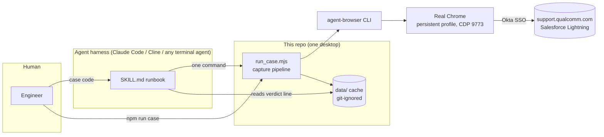
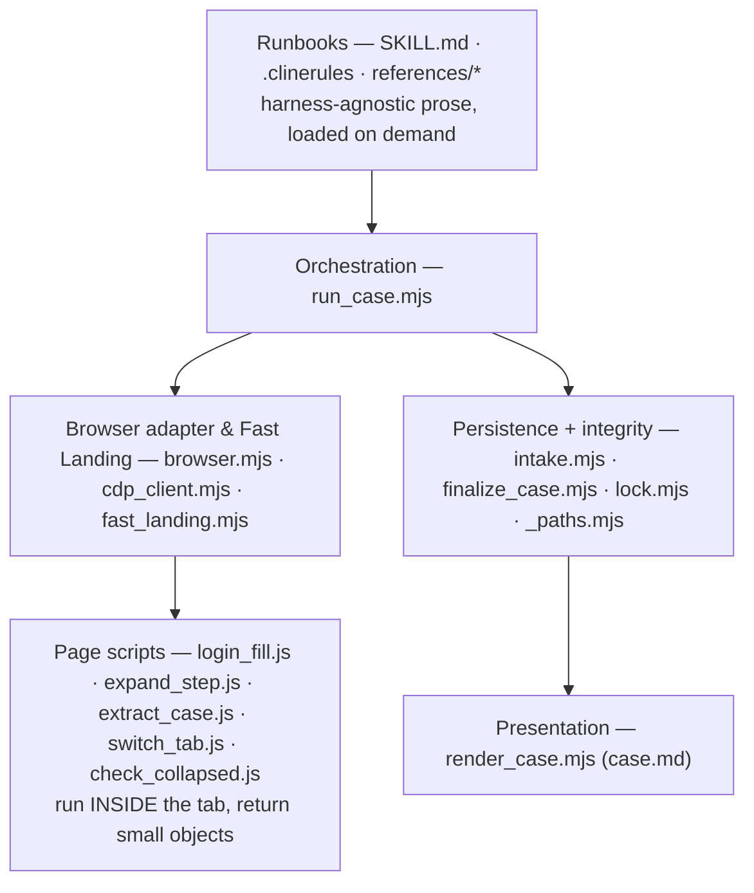
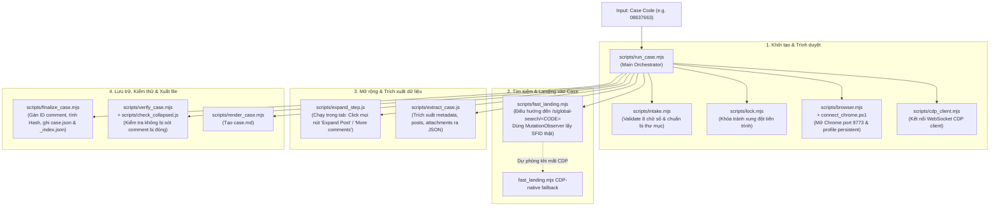
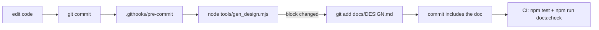

# Design & Architecture — `qualcomm-case-agent`

**Audience:** architecture review, senior/expert developers joining or auditing this pipeline.
**Scope:** the whole repo — the agent skill and the headless capture pipeline. This is a
capture-only tool: given a case code, search the portal, save the data. Nothing else.
**Status:** describes the code at the fingerprint recorded in §7. Sections 1–6 and 8–12 are
hand-written (intent, rationale, trade-offs); §7 is generated from the source on every commit
(see §12).

---

## 1. Problem, constraints, non-goals

### 1.1 The problem

Qualcomm Support (`support.qualcomm.com`) is a Salesforce Lightning portal. A support case is a
Chatter feed: metadata plus an arbitrarily long, paginated, collapsed comment thread carrying the
actual engineering content (symptoms, QXDM logs, 3GPP references, requests for data). Engineers
need two things the portal does not give them:

1. **The complete case offline** — every comment verbatim, not the first page, not a summary.
2. **To know when it changes** — without re-reading a 40-comment thread by hand.

### 1.2 Constraints that shaped every decision

| # | Constraint | Consequence |
|---|---|---|
| C1 | **No API.** The portal exposes no case API to this account; the DOM is the interface. | Browser automation is the only transport. |
| C2 | **Okta SSO with email OTP.** The 6-digit code arrives in a mailbox no automation here can read. | Full unattended auth is *impossible*; the design must degrade to "ask the human once", not retry-loop. |
| C3 | **NDA content.** Case bodies, logs and customer names are confidential. | Cache stays local + git-ignored; nothing is sent to an external service. |
| C4 | **Model tokens are the dominant cost.** The measured baseline was 123k input tokens for one case (flow 1784759542159), almost all of it browser choreography. | Anything deterministic must leave the model's context entirely. |
| C5 | **Windows + PowerShell host, driven by more than one agent harness** (Claude Code, Cline). | No shell-quoted payloads; no bash-only idioms; every step must be a single plain command. |
| C6 | **Fidelity over convenience.** A truncated comment is worse than no comment. | Capture is verbatim; completeness is asserted before persisting. |

### 1.3 Non-goals

- Multi-case capture in one invocation — one case per run.
- Writing back to the portal (read-only by ToS and by design).
- A hosted/multi-user service — this is a single-desktop tool, and C3 keeps it that way.
- Analyzing or summarizing the case — this tool captures; interpretation is left to whoever reads
  `case.json` next.

---

## 2. System context



The trust boundary is the desktop. Nothing leaves it except the authenticated HTTPS session to
Qualcomm.

---

## 3. Architecture

### 3.1 The central decision: **capture is deterministic code, zero model tokens**

This is the load-bearing decision of the whole system. Every step of retrieval — sign in, resolve
the case URL, paginate, expand posts, read the DOM, hash, merge, render — is a *decision-free*
procedure. Driving it turn-by-turn through an agent means dumping a Salesforce accessibility tree
into a model's context dozens of times so it can find one element reference to click. That is C4's
123k tokens, and none of it is reasoning.

So the pipeline is split at the point where judgement would begin:

| Layer | Owner | Cost | Contract |
|---|---|---|---|
| Retrieval + persistence + rendering | `run_case.mjs` and friends (plain Node) | 0 tokens | one JSON verdict line on stdout, one exit code |
| Orchestration + reporting to the human | the agent harness | one verdict line | SKILL.md |

The agent's entire view of a capture is ~200 tokens. `SKILL.md` states the rule explicitly:
*"Do NOT `Read` `case.json` to find out what happened."*

### 3.2 Layers & End-to-End Execution Flow



#### End-to-End Execution Flow



Two properties fall out of this layering and are worth stating as rules, because most of the
project's historical bugs were violations of them:

- **Nothing crosses a shell.** `browser.mjs` spawns `agent-browser` with an argv array; page
  scripts cross as base64 or run via native WebSocket CDP (`cdp_client.mjs`). No quoting, no dialect (§4, D4/D5).
- **Page scripts return counters, never DOM dumps.** `expand_step.js` clicks *inside the page* in a
  loop and returns `{articles, displayed, anchorIdx, clicked…}` — a few dozen bytes replacing ~15
  snapshot round-trips per case.

### 3.3 Component responsibilities

| Component | Responsibility | Explicitly not responsible for |
|---|---|---|
| `intake.mjs` | Validate the 8-digit code, create cache dirs, sanity-check `_index.json` | Anything network |
| `browser.mjs` | Chrome lifecycle on CDP 9773, `eval -b` transport, error typing (`BrowserError`) | Knowing anything about cases |
| `cdp_client.mjs` | Native lightweight WebSocket CDP client (zero external binary dependencies for core landing) | DOM logic or parsing |
| `fast_landing.mjs` | Fast-path direct navigation (cached SFID) + event-driven DOM MutationObserver search landing | Scraping comment feeds |
| `login_fill.js` | Fill Okta username/password via CDP and classify outcome: AUTHENTICATED/OTP_REQUIRED/REJECTED | DOM parsing outside Okta |
| `expand_step.js` | One expansion/pagination tick; doubles as the fast no-update probe | Extraction |
| `extract_case.js` | Read the expanded DOM into the raw case object | Completeness policy |
| `finalize_case.mjs` | Completeness gates, merge policy, SHA-256 identity, canonical write, index update | Browser, analysis |
| `render_case.mjs` | Deterministic formatting of whatever is in `case.json` | Summarizing, reordering, inventing |

---

## 4. Design decisions and why

Each decision is stated with the alternative that was rejected and the cost that was accepted —
that is what makes it reviewable.

| # | Decision | Alternative rejected | Why | Accepted cost |
|---|---|---|---|---|
| D1 | **Real system Chrome over CDP 9773 with a persistent `--user-data-dir`** | Playwright's bundled Chromium; a fresh headless context per run | The bundled build's CDP handshake broke (`os error 10060`); more fundamentally, the Okta session must *survive between runs* (C2) — a persistent, OS-trusted, signed browser profile is what makes MFA one-time (~30 days) instead of per-run | A real desktop session is required; the machine must be logged in; profile is user-bound and non-portable |
| D2 | **Capture is deterministic code — zero model tokens** (§3.1) | Agent-drives-browser choreography | C4: ~123k → ~5k tokens per case | The pipeline must encode DOM knowledge that a model could have improvised; DOM drift becomes a code change |
| D3 | **In-page click loops** (`expand_step.js`) instead of snapshot→ref→click | `agent-browser snapshot -c` + one click per control | Removes the dominant token cost and ~15 round-trips per case; the loop is trivially bounded | The page script cannot ask for help; it must be defensive and return diagnostics |
| D4 | **`agent-browser eval -b <base64>`** for every page script | `eval --stdin`, `<` redirection, inline JS | `--stdin` **silently returns `null`** when fed from a PowerShell pipe (reproduced live, flow 1784759542159 §3); base64 has no shell metacharacters, so the nested-quote class of bug disappears too | 8191-char cmd.exe ceiling → `browser.mjs` strips comments and refuses payloads > 7000 b64 chars |
| D5 | **Node `spawnSync` with an argv array; on Windows one hand-built `cmd.exe` line rejecting metacharacters** | `shell: true`, PowerShell wrappers | Five distinct quoting failures in one flow (flow 1784759542159 §1). An argv array is not re-tokenized on POSIX; on Windows the metachar check turns a silent mangling into a loud error | A path containing `& \| < > ^ " % !` fails fast rather than being escaped (§11, I7) |
| D6 | **The agent↔code contract is one JSON line + a distinct exit code per outcome** | Prose output, or the agent reading `case.json` | Machine-checkable, cheap, and needs no model in the loop to branch on | The verdict schema is now public API — a status rename is a breaking change for every caller |
| D7 | **Incremental sync via SHA-256 over verbatim fields only** (`computeHash`) | Timestamp comparison; hashing the whole file | Identity should track only what a human wrote, not incidental fields elsewhere in the file. Stable field order ⇒ stable hash across runs | The hash covers relative timestamps, which drift, so a full re-capture can hash differently with no real change (§11, I16) |
| D8 | **Anchor-based incremental expansion** — stop paginating at the newest cached comment | Always full expansion | An update run on a 40-comment case touches only the new posts; the cached bodies are kept verbatim rather than re-scraped | Nested replies under old posts can hide from the probe (§11, I5) |
| D9 | **Merge policy: cache is authoritative for old content; the fresh page only fills blanks; CLI header flags win on an update** | Overwrite with the fresh capture | An update capture is deliberately *partial* — old posts stay collapsed. Overwriting would truncate good cached data. But Status/Priority genuinely change over a case's life, so those are taken from the fresh search row | Merge identity depends on the `commentKey` heuristic (§11, I3) |
| D10 | **Fail-closed completeness gates before any write**: 0 comments → `INCOMPLETE`; captured < displayed → `INCOMPLETE`; empty title → `INCOMPLETE` | Persist and warn | A failed pull must never overwrite a good cached case, and an empty title is "a failed pull dressed as success" | A legitimately odd case (no title on an archived record) is rejected; the manual flow exists for that |
| D11 | **`blocked` is never downgraded to `no-update`** | Treat a probe failure as "nothing changed" | "Unchanged" is a positive finding. Reporting it on a failed probe is the one wrong answer this tool can give a user — it is silent data loss | Some runs end inconclusive and need a human |
| D12 | **Plain JSON files as the entire datastore** (`case.json`, `_index.json`) | SQLite / an embedded DB | Single-writer, single-desktop, human-inspectable, diff-able, trivially backed up, and readable by an agent with a Read tool. A DB would add a dependency and a migration story for no gain at this scale | Read-modify-write races between concurrent capture invocations (mitigated, not eliminated — §11, I6) |
| D13 | **Advisory PID+timestamp capture lock** (`data/.capture.lock`, stale after 30 min or dead PID) | An OS mutex; a job queue | All capture paths drive the *same* Chrome tab; two at once interleave navigation. A `busy` verdict is a correct, cheap answer | Closed exists→write race with atomic `wx` write; stale takeover after 30 min or dead PID |
| D17 | **The skill lives in the repo** (`.claude/skills/…`), harness-agnostic, references loaded on demand | A global/installed skill; one monolithic runbook | The runbook travels with the code it drives, so they cannot drift apart across machines; on-demand references cut activation from ~15.6k to ~4.7k tokens | Two harness entry points to maintain (`SKILL.md`, `.clinerules/`) |
| D18 | **Paths resolve by walking up to a marker** (`_paths.mjs` / `_paths.ps1`), never from CWD | `../..` relative paths | An interactive run started from any subdirectory must agree with every other invocation on one cache. Re-nesting the skill does not break it | A `QUALCOMM_ROOT` escape hatch is needed for layouts with no `.git` |
| D19 | **Comment identity is content-derived** (`commentId` = hash of author + body prefix), assigned in the finalizer | Positional ids from the extractor; trusting the Chatter DOM id | A positional id meant a full re-capture re-keyed every comment on every run, purely from a reshuffled feed order, with no way to tell a genuinely new comment from one that just moved. Deriving the id from the content that defines the comment removes the dependency on position entirely | Two comments with the same author and same opening 120 chars are ambiguous; they are kept distinct with a `-N` suffix and reported as `idCollisions` rather than resolved silently. Caches on the old scheme are migrated on read (`migrateIds`) and re-hash once |
| D20 | **Unified Case Synchronization Seam (`syncCaseOverview`)** | Ad-hoc callers manually parsing `_overview.json` and triggering HTML rendering | Encapsulates presence detection, atomic cache mutation for both upsert and remove, stats calculation, and dashboard rendering behind a single interface. Rendering errors are trapped and warned non-fatally; callers (capture, summary, delete) never fail due to an overview glitch | Callers must conform to the seam options contract (`casesDir`, `action`, `render`, `onError`, `renderDashboard`) |

---

## 5. Data model and state

### 5.1 `data/cases/<CODE>/case.json` — the source of truth

```jsonc
{
  "caseNumber": "08603854",
  "title": "…", "status": "…", "priority": "…", "severity": "…",
  "product": "…", "accountName": "…", "contactName": "…", "customerProject": "…",
  "customerTracking": "…", "relatedCRs": "…", "caseRecordType": "…",
  "openedAt": "…", "closedAt": "…", "updated": "…",
  "description": "…",
  "url": "https://support.qualcomm.com/s/case/<SFID>/<slug>",
  "displayedCommentCount": 11,            // portal's own top-level total, or null
  "comments": [                            // OLDEST FIRST nested tree (subs:[] holds replies oldest-first), verbatim, never truncated
    { "id": "c9f2a1b7c4d0",                // content id — sha256(author + body prefix), see below
      "timestamp": "…", "author": "…",
      "body": "…", "subs": [], "analysisLog": [], "attachments": [] }
  ],
  "hash": "<sha256 over verbatim fields only>",
  "extractedAt": "<ISO-8601>"
}
```

**Invariant:** raw fields and `hash` are written by `finalize_case.mjs` alone; nothing else ever
mutates them.

**Comment identity (D19).** `id` is derived from the comment's own content — `commentId(c)` =
`sha256(author + whitespace-normalized body prefix)` — and assigned by the finalizer for every
persisted comment, whatever the extractor supplied. The same comment keeps the same id across
every capture regardless of its position in the feed, so merge/dedup stays stable across a full
re-capture; a duplicate identity is a real ambiguity, so it is kept as a separate comment with a
`-N` suffix and counted in the verdict's `idCollisions` instead of being merged away. A cache
written with the old positional ids (`c1`, `c2`, …) is migrated on read by `migrateIds`.

**Comment tree structure & order (reverts 2026-08-27 presentation-only newest-first decision to PRD #105-109 "Variant A").**
Top-level comments and each comment's direct replies (`subs`) are persisted in strict chronological order
(oldest to newest). Nesting position in `subs` is the only source of truth for parent/child relationships (`parentId` is dropped).
The internal merge/dedup engine (`sortCommentsChronological`, `mergeComments`) works in strict ascending order.

`isNoUpdate(probe, cached)` returns true only when **both** hold: the newest cached comment is
still `articles[0]`, and the portal's own displayed total is unchanged. Anything else — a null
probe, a missing anchor, a changed total — is *not* unchanged. The unit tests pin this ("never lets
a failed probe read as unchanged"), and D11 is the policy behind it.

### 5.2 `data/cases/_overview.json` & `dashboard.html` — Case Synchronization Seam (`syncCaseOverview`)

The aggregated case index (`_overview.json`) and the offline static HTML dashboard (`dashboard.html`) are updated exclusively through a single, unified synchronization seam: `syncCaseOverview(caseNumber, options)`.

#### Interface Contract

```javascript
/**
 * @param {string} caseNumber - 8-digit Qualcomm case code
 * @param {object|string} [options={}] - Options object (or dataDir string for backwards compatibility)
 * @param {'upsert'|'remove'} [options.action='upsert'] - Operation to perform ('upsert' or 'remove')
 * @param {string} [options.casesDir=DEFAULT_CASES_DIR] - Directory containing cases and overview artifacts
 * @param {boolean} [options.render=true] - Whether to generate/update dashboard.html
 * @param {function} [options.renderDashboard=renderDashboardHtml] - Injectable HTML dashboard renderer
 * @param {function} [options.onError] - Optional error handler callback (err, stage)
 * @returns {{ hadEntry: boolean, overviewData: object, rendered: boolean }}
 */
```

#### Guarantees & Invariants

1. **Atomic Cache Persistence**: `_overview.json` is persisted using atomic temp-file-and-rename (`_overview.json.tmp.<pid>.<time>` -> `_overview.json`), preventing corruption or partial reads.
2. **Dashboard Render Isolation**: HTML rendering errors are trapped within `syncCaseOverview` and emitted as non-fatal warnings to `stderr` (`Warning: dashboard render failed (<reason>)`), returning `rendered: false`. Capture (`finalize_case.mjs`), summary (`run_summary.mjs`), and delete (`delete_case.mjs`) operations always complete successfully even if dashboard rendering fails.
3. **Presence Detection (`hadEntry`)**: The seam inspects and returns whether the target case existed in `_overview.json` prior to the sync operation, allowing deletion to distinguish cleanly between `deleted` and `not-found`.
4. **Dependency Injection**: Callers can inject `syncCaseOverview`, `renderDashboard`, and `onError` directly without requiring ESM module mocking.

---

## 7. Module and function reference *(generated)*

<!-- BEGIN GENERATED: reference -->

> Generated by `npm run docs` from the source tree — **do not edit by hand**.
> Source fingerprint `e76b7ce42cd3` over 83 files.
> Stale block ⇒ `npm run docs:check` fails.

#### Qcomm scripts

| File | Lines | Purpose |
|---|---|---|
| `.claude/skills/qcomm/scripts/_paths.mjs` | 91 | single source of truth for skill paths (Node / ESM). |
| `.claude/skills/qcomm/scripts/_paths.ps1` | 45 | PowerShell adapter onto _paths.mjs (single source of truth). |
| `.claude/skills/qcomm/scripts/browser.mjs` | 264 | thin Node wrapper around the `agent-browser` CLI. |
| `.claude/skills/qcomm/scripts/cases_overview.mjs` | 172 | CLI orchestrator: wires the overview store, dashboard renderer, and CLI table renderer together into the `cases_overview` command. |
| `.claude/skills/qcomm/scripts/cdp_client.mjs` | 484 | Deep Module: Native WebSocket CDP client for Chrome DevTools Protocol. |
| `.claude/skills/qcomm/scripts/cdp_portal_driver.mjs` | 325 | production PortalDriver: drives the persistent- profile Chrome over CDP. |
| `.claude/skills/qcomm/scripts/cli_renderer.mjs` | 68 | Renders the terminal summary table for Qualcomm case overview data. |
| `.claude/skills/qcomm/scripts/connect_chrome.ps1` | 170 | launch REAL system Chrome detached with a CDP port + dedicated persistent profile, ready for 'agent-browser connect <port>'. |
| `.claude/skills/qcomm/scripts/dashboard_renderer.mjs` | 1646 | Renders the self-contained, offline HTML dashboard for Qualcomm case overview data. |
| `.claude/skills/qcomm/scripts/delete_case.mjs` | 131 | permanent, agent-confirmed removal of one case's local cache. |
| `.claude/skills/qcomm/scripts/dom_extractor.js` | 1008 | Unified, namespaced DOM extractor and browser automation helper module. |
| `.claude/skills/qcomm/scripts/ensure_protocol.mjs` | 180 | Core Self-Healing Protocol Engine for Qualcomm Case Agent (`qc://`). |
| `.claude/skills/qcomm/scripts/fast_landing.mjs` | 422 | — |
| `.claude/skills/qcomm/scripts/finalize_case.mjs` | 1035 | Persistence post-processor for the AGENT-DRIVEN extraction. |
| `.claude/skills/qcomm/scripts/fixture_portal_driver.mjs` | 132 | offline PortalDriver: replays pre-recorded snapshots instead of driving Chrome. |
| `.claude/skills/qcomm/scripts/intake.mjs` | 62 | Intake guard: validate case code + prep cache dirs. |
| `.claude/skills/qcomm/scripts/lock.mjs` | 87 | one capture at a time, machine-wide. |
| `.claude/skills/qcomm/scripts/open_qc_case.mjs` | 375 | Deep Module: Core URI Parser & CDP / Chrome Dispatcher for qc:// custom protocol scheme. |
| `.claude/skills/qcomm/scripts/overview_lock.mjs` | 95 | Process lock module guarding _overview.json atomic read-modify-write-rename operations. |
| `.claude/skills/qcomm/scripts/overview_store.mjs` | 443 | Data/domain module: scans case directories, shapes overview records, computes stats, and persists the aggregated _overview.json atomically. |
| `.claude/skills/qcomm/scripts/portal_driver.mjs` | 79 | the seam between run_case.mjs (orchestration: verdicts, retries, screenshots-per-failure-mode) and however a case actually gets read off the portal. |
| `.claude/skills/qcomm/scripts/recover_chrome.ps1` | 66 | Recovery 0 as ONE script (was a raw PowerShell block pasted into SKILL.md, which errored when the agent ran it through the Bash tool: 'Where-Object' is not recognized ...). |
| `.claude/skills/qcomm/scripts/register_protocol.ps1` | 67 | Registers the custom URL protocol scheme (qc://) in the Windows Registry for the current user. |
| `.claude/skills/qcomm/scripts/render_case.mjs` | 249 | deterministic markdown renderer for the Qualcomm Case Management Agent. |
| `.claude/skills/qcomm/scripts/run_case.mjs` | 484 | the whole capture pipeline as ONE deterministic command. |
| `.claude/skills/qcomm/scripts/run_summary.mjs` | 398 | orchestrator for qcomm summary. |
| `.claude/skills/qcomm/scripts/secret_store.mjs` | 51 | DPAPI secret store for Qualcomm ID password (issue #126). |
| `.claude/skills/qcomm/scripts/staleness.mjs` | 21 | Shared staleness formatting, used by both the HTML dashboard and CLI table renderers. |
| `.claude/skills/qcomm/scripts/unregister_protocol.ps1` | 28 | Unregisters the custom URL protocol scheme (qc://) from the Windows Registry for the current user. |
| `.claude/skills/qcomm/scripts/verify_case.mjs` | 175 | post-capture QA gate for run_case.mjs's output. |

Exported API — qcomm scripts:

| Module | Export | Kind | Contract |
|---|---|---|---|
| `_paths.mjs` | `SKILL_ROOT` | value |  |
| `_paths.mjs` | `findProjectRoot(start)` | function |  |
| `_paths.mjs` | `PROJECT_ROOT` | value |  |
| `_paths.mjs` | `DATA_DIR` | value |  |
| `_paths.mjs` | `SECRET_PATH` | value |  |
| `_paths.mjs` | `PROFILE_DIR` | value |  |
| `_paths.mjs` | `USER_PATH` | value |  |
| `_paths.mjs` | `QUALCOMM_USER` | value |  |
| `browser.mjs` | `CDP_PORT` | value |  |
| `browser.mjs` | `getCdpClient(options = {})` | async fn |  |
| `browser.mjs` | `BrowserError` | value |  |
| `browser.mjs` | `PortConflictError` | value | Thrown by ensureChrome() when the CDP port answers, but the process behind it is not this project's persistent-profile Chrome — a different tool got there first. |
| `browser.mjs` | `evalFileViaCdp(cdp, scriptPath, vars = {})` | async fn | Evaluate a page script (strips comments, wraps in the payload IIFE) sent straight over an already-open CDP WebSocket via `cdp.eval` instead of shelling out through cmd.exe. |
| `browser.mjs` | `buildPayload(src, vars = {})` | function | Wrap a page script (always a single IIFE expression) in a function scope that declares its parameters. |
| `browser.mjs` | `stripComments(src)` | function | Drop whole-line `//` comments and blank lines. |
| `browser.mjs` | `parseResult(stdout)` | function | agent-browser prints the serialized result; take the last JSON-ish line. |
| `browser.mjs` | `open(url)` | function |  |
| `browser.mjs` | `screenshot(path, options = {})` | async fn | Full-page PNG of the feed exactly as expansion left it — the visual evidence that every "Expand Post" / "More comments" really did get clicked. |
| `browser.mjs` | `getPortOwnerCommandLine(port)` | function | Windows-only: ask the OS which process owns the listening CDP port and return its full command line (null if none/unavailable). |
| `browser.mjs` | `ownsProfile(commandLine, profileDir = PROFILE_DIR)` | function | True only when a command line launched Chrome with THIS project's persistent profile dir as user-data-dir — the one signal that says a CDP port is actually ours, not some unrelated tool that happened to grab it. |
| `browser.mjs` | `ensureChrome({ launch = true } = {})` | async fn | PHASE 0 as code: make sure agent-browser is driving the persistent-profile Chrome. |
| `browser.mjs` | `sleep(ms)` | function |  |
| `cases_overview.mjs` | `openInBrowser(filePath)` | function | Opens a local file in the default OS web browser. |
| `cases_overview.mjs` | `parseArgs(args)` | function | Parses CLI arguments. |
| `cases_overview.mjs` | `rebuildOverview(casesDir = DEFAULT_CASES_DIR)` | function | Rebuilds overview data and atomically writes _overview.json. |
| `cdp_client.mjs` | `CdpError` | value |  |
| `cdp_client.mjs` | `CdpClient` | value |  |
| `cdp_portal_driver.mjs` | `CdpPortalDriver` | value |  |
| `cli_renderer.mjs` | `renderCliTable(overviewData, options = {})` | function | Renders formatted terminal summary and case table. |
| `dashboard_renderer.mjs` | `escapeHtml(str)` | function | Escapes HTML characters in string to prevent XSS. |
| `dashboard_renderer.mjs` | `getStatusCategory(status, ballInCourt)` | function | Categorizes status for badge colors and filtering. |
| `dashboard_renderer.mjs` | `renderCaseRow(c)` | function | Renders the summary row and expandable detail row pair for a single case. |
| `dashboard_renderer.mjs` | `renderStyles()` | function | Renders embedded CSS stylesheet for the dashboard. |
| `dashboard_renderer.mjs` | `renderHeader(stats)` | function | Renders dashboard header with case counts, last updated timestamp, and action toolbar. |
| `dashboard_renderer.mjs` | `renderControlsBar(stats, counts)` | function | Renders search input and filter navigation tabs with status counts. |
| `dashboard_renderer.mjs` | `renderCasesTable(rowsHtml)` | function | Renders the cases table wrapper and headers around rendered rows. |
| `dashboard_renderer.mjs` | `renderProtocolModal()` | function | Renders the Protocol Help modal dialog for custom URI scheme registration. |
| `dashboard_renderer.mjs` | `renderClientScript()` | function | Renders embedded client-side script for filtering, searching, and interactions. |
| `dashboard_renderer.mjs` | `renderDashboardHtml(overviewData, outputPath = null)` | function | Generates self-contained, offline HTML Dashboard. |
| `delete_case.mjs` | `STATUS_EXIT` | value |  |
| `delete_case.mjs` | `deleteCase(rawCode, dataDir = DATA_DIR, options = {})` | function | Delete one case's entire local cache: its directory, its _index.json entry, then resync the qcomm overview aggregation/dashboard. |
| `ensure_protocol.mjs` | `isProtocolRegistered(options = {})` | function | Checks if the qc:// custom URL protocol scheme is registered in Windows Registry. |
| `ensure_protocol.mjs` | `ensureProtocolRegistered(options = {})` | function | Ensures the qc:// custom URL protocol scheme is registered. |
| `fast_landing.mjs` | `STUB_PATH_RE` | value |  |
| `fast_landing.mjs` | `isStubUrl(url)` | function | Checks if a URL is empty or points to the generic Lightning un-routed case stub. |
| `fast_landing.mjs` | `fastLandOnCase(code, options = {})` | async fn | Fast-path direct navigation and event-driven landing engine. |
| `finalize_case.mjs` | `EXIT` | value | Exit codes (exported so tests can import) |
| `finalize_case.mjs` | `computeHash(raw)` | function | Hash only the raw, verbatim fields. |
| `finalize_case.mjs` | `findCollapsed(comments, newIds)` | function | Only check comments NEW to this capture — a merge (and a full re-capture of a cache) deliberately leaves OLD posts collapsed (see expand_step.js) and keeps their cached verbatim bodies, so those legitimately still carry the label in the freshly re-extracted DOM. |
| `finalize_case.mjs` | `countAssert(capturedCount, displayedCount)` | function | Completeness gate comparison (Issue #91): The Salesforce Chatter badge ("N Chatter Feed Items") counts only top-level posts, whereas our Feed extractor captures both top-level posts AND nested replies (e.g. |
| `finalize_case.mjs` | `HEADER_KEYS` | value | Header fields the agent already holds in-context from the PHASE 1 search row. |
| `finalize_case.mjs` | `DETAIL_KEYS` | value | Salesforce Lightning Detail tab metadata fields persisted to canonical case.json. |
| `finalize_case.mjs` | `parseHeaderFlags(argv)` | function | Parse ` title "..."` style flags into an overrides object. |
| `finalize_case.mjs` | `commentKey(c)` | function | Stable identity for dedup across runs. |
| `finalize_case.mjs` | `commentId(c)` | function | Content-derived comment id: the same comment gets the same id in every run, whatever position it now occupies in the feed. |
| `finalize_case.mjs` | `assignIds(comments)` | function | Assign content ids to a comment list. |
| `finalize_case.mjs` | `migrateIds(cached)` | function | Bring a cached case written with the old positional ids (c1, c2, …) or with raw DOM ids onto content ids. |
| `finalize_case.mjs` | `isBlacklistedTs(s)` | function | Checks if a timestamp string contains Salesforce/Chatter UI tooltip noise. |
| `finalize_case.mjs` | `extractSummary(body)` | function | Extracts a concise 1-2 sentence preview summary from raw comment body, stripping common email greetings/salutations. |
| `finalize_case.mjs` | `synthesizeDescriptionComment(raw)` | function | Synthesizes an initial comment representing the case problem statement from raw case description, if non-empty. |
| `finalize_case.mjs` | `hasDescriptionComment(comments, description)` | function | Checks if a comment matching the case description is already present. |
| `finalize_case.mjs` | `countAllComments(comments)` | function | Count all comments recursively through nested subs. |
| `finalize_case.mjs` | `genuineCommentCount(comments, description)` | function | The synthesized description comment is a presentation convenience derived from the Case's description field, not a captured Chatter feed item — the completeness gate must compare against genuine portal comments only. |
| `finalize_case.mjs` | `classifyRole(author, company = '', context = '', body = '')` | function | Classifies author role into 'Qualcomm', 'Customer', or 'System' based on author name, company, and body clues. |
| `finalize_case.mjs` | `parseTimestamp(ts, referenceDate = new Date())` | function | Normalizes and parses various timestamp formats into epoch milliseconds. |
| `finalize_case.mjs` | `isRelativeTimestamp(ts)` | function | Checks if a timestamp string is a relative Chatter format (e.g. |
| `finalize_case.mjs` | `normalizeComment(comment, referenceDate = new Date())` | function | Normalizes any relative or non-ISO absolute Chatter timestamp to an ISO-8601 string resolved against capture reference date, retaining raw portal string in `rawTimestamp`. |
| `finalize_case.mjs` | `normalizeComments(comments, referenceDate = new Date())` | function | Normalizes all comments in an array. |
| `finalize_case.mjs` | `sortCommentsChronological(comments, referenceDate = new Date())` | function | Sorts comments strictly in chronological order (Oldest -> Newest). |
| `finalize_case.mjs` | `flattenComments(comments)` | function | Flatten a nested tree (case.json's subs:[] shape) back to a flat array with parentId re-attached. |
| `finalize_case.mjs` | `buildNestedTree(comments)` | function | Build a nested tree from a flat list that already has parentId set. |
| `finalize_case.mjs` | `mergeComments(cachedComments, rawComments, referenceDate = new Date())` | function | Merge raw comments not already cached and enforce chronological sorting (Oldest -> Newest). |
| `finalize_case.mjs` | `finalize(caseCode, rawPath, header = {}, merge = false, options = {})` | function | Main |
| `fixture_portal_driver.mjs` | `DEFAULT_FIXTURE_DIR` | value |  |
| `fixture_portal_driver.mjs` | `FixturePortalDriver` | value |  |
| `intake.mjs` | `normalizeCaseCode(raw)` | function | Validate a case code shape: exactly 8 digits, tolerating a leading CASE- prefix and surrounding whitespace. |
| `intake.mjs` | `intake(raw)` | function | Validate a case code and prepare its cache folder. |
| `lock.mjs` | `LOCK_PATH` | value |  |
| `lock.mjs` | `acquireLock(path = LOCK_PATH, now = Date.now(), code)` | function | Try to take the capture lock. |
| `lock.mjs` | `releaseLock(path = LOCK_PATH)` | function |  |
| `lock.mjs` | `acquireLockOrWaitForSameCode(path = LOCK_PATH, code, opts = {})` | async fn | Same as acquireLock, but a refusal by a holder capturing the SAME code polls (bounded by timeoutMs) instead of refusing immediately — a same-case collision is usually about to resolve itself once the other run finishes. |
| `open_qc_case.mjs` | `PROJECT_ROOT` | value |  |
| `open_qc_case.mjs` | `DEFAULT_CASES_DIR` | value |  |
| `open_qc_case.mjs` | `DEFAULT_PROFILE_DIR` | value |  |
| `open_qc_case.mjs` | `DEFAULT_CDP_PORT` | value |  |
| `open_qc_case.mjs` | `isValidQualcommUrl(urlString)` | function | Validate that a URL domain belongs to Qualcomm support. |
| `open_qc_case.mjs` | `parseQcUri(uriString)` | function | Parse an incoming qc:// custom protocol URI string into a structured target object. |
| `open_qc_case.mjs` | `ensureCommunicationTabUrl(urlString)` | function | Ensures a Qualcomm support case URL activates tab 1 (Communication tab) by default. |
| `open_qc_case.mjs` | `resolveTargetUrl(parsed, options = {})` | function | Resolve destination URL for a parsed target object. |
| `open_qc_case.mjs` | `dispatchQcTarget(targetUrl, options = {})` | async fn | Dispatch target URL to either an active Chrome instance via CDP or launch a new instance. |
| `open_qc_case.mjs` | `openQcCase(rawUri, options = {})` | async fn | End-to-end entrypoint: parse URI, resolve URL, and dispatch navigation. |
| `overview_lock.mjs` | `acquireOverviewLock(casesDir, opts = {})` | function | Acquires exclusive lock guarding _overview.json's read-modify-write-rename. |
| `overview_lock.mjs` | `releaseOverviewLock(lock)` | function | Releases a lock acquired by acquireOverviewLock. |
| `overview_lock.mjs` | `withOverviewLock(casesDir, fn, opts = {})` | function | High-level helper executing fn within an acquired overview lock. |
| `overview_store.mjs` | `DEFAULT_CASES_DIR` | value |  |
| `overview_store.mjs` | `createCommentSnippet(comment, maxLen = 160)` | function | Normalizes text snippet from a comment (removes duplicate whitespace/newlines, truncates). |
| `overview_store.mjs` | `extractProductFromTitle(title)` | function | Extracts product code from title if product field is missing or empty. |
| `overview_store.mjs` | `extractAiSummary(summaryJson)` | function | Extracts formatted AI executive summary from summary.json data. |
| `overview_store.mjs` | `extractCaseOverview(caseDir, caseNumber = '')` | function | Extracts normalized overview record for a single case directory. |
| `overview_store.mjs` | `computeStats(cases)` | function | Recomputes overview statistics from an array of cases. |
| `overview_store.mjs` | `buildOverviewData(casesDir = DEFAULT_CASES_DIR)` | function | Scans all case directories in casesDir and aggregates overview data. |
| `overview_store.mjs` | `syncCaseOverview(caseNumber, options = {})` | function | Unified, resilient synchronization seam for case overview cache and dashboard. |
| `overview_store.mjs` | `updateCaseOverview(caseNumber, casesDir = DEFAULT_CASES_DIR)` | function | Incrementally updates or inserts a single case record in _overview.json atomically. |
| `overview_store.mjs` | `afterFinalize(caseCode, dataDir, options = {})` | function | Resilient synchronization hook for a finalized case (capture or summary). |
| `overview_store.mjs` | `applyFilter(overviewData, filter)` | function | Filters overview cases by status string (case-insensitive substring match). |
| `portal_driver.mjs` | `PortalDriver` | value |  |
| `render_case.mjs` | `formatBody(body)` | function | Format a comment or description body for Markdown rendering. |
| `render_case.mjs` | `walkCommentTree(comments, visitor, prefix = '', depth = 0, parent = null)` | function | Tree Walk */ Walks a nested comment tree (with subs: []) and yields a flat list of comment entries decorated with hierarchical numbers (e.g. |
| `render_case.mjs` | `generateMarkdown(data, stem = 'case')` | function | Markdown */ |
| `render_case.mjs` | `renderCase(jsonPath)` | function |  |
| `run_case.mjs` | `STATUS_EXIT` | value |  |
| `run_case.mjs` | `anchorOf(cached)` | function | Anchor = the newest CACHED comment; PHASE 1.5B stops paginating there. |
| `run_case.mjs` | `mergeDetailFields(raw, detailRaw, fields)` | function | Detail tab is the only tab that actually renders `fields`; Feed-tab `raw` can still stumble onto a non-empty value for them (wrong DOM region), so detailRaw wins whenever present, and raw is the fallback only when detailRaw didn't capture the field. |
| `run_case.mjs` | `formatVerdict(code, v = {}, started)` | function | Standardize single-line verdict output object. |
| `run_case.mjs` | `isNoUpdate(probe, cached)` | function | Unchanged iff the newest cached comment is still the top post AND nothing on the feed is still hiding content. |
| `run_case.mjs` | `run(code, opts = {})` | async fn |  |
| `run_case.mjs` | `parseArgs(argv)` | function |  |
| `run_summary.mjs` | `CHAR_CAP` | value | cap.mjs inline |
| `run_summary.mjs` | `applyCharCap(body, cap = CHAR_CAP)` | function |  |
| `run_summary.mjs` | `applyCharCapToComments(comments, cap = CHAR_CAP)` | function |  |
| `run_summary.mjs` | `computeDelta(caseComments, summarizedIds)` | function | delta.mjs inline caseComments may be a nested tree (subs:[], per #233) or a flat legacy array; walkCommentTree handles both and flattens to every comment at every depth, so a reply the top-level filter used to miss is still checked against summarizedIds. |
| `run_summary.mjs` | `captureCase(code)` | async fn | deps.mjs inline |
| `run_summary.mjs` | `mergeSummary(prior, { caseNumber, title, url, priority, product, status, newComments, parentIdOf, commentOrder, flow, executive, now })` | function | merge.mjs inline |
| `run_summary.mjs` | `renderSummaryMd(summary)` | function |  |
| `run_summary.mjs` | `prepare(code)` | async fn |  |
| `run_summary.mjs` | `finalize(code, { comments: newComments, flow, executive }, options = {})` | function |  |
| `run_summary.mjs` | `summarize(code, payload, options = {})` | async fn |  |
| `run_summary.mjs` | `readPayloadFromArgs(args)` | async fn |  |
| `secret_store.mjs` | `readPassword(secretPath = SECRET_PATH)` | function | Decrypt and return the stored Qualcomm ID password, or null if missing/failed. |
| `secret_store.mjs` | `clearSecret(secretPath = SECRET_PATH)` | function | Delete the stored secret file (idempotent no-op if already missing). |
| `staleness.mjs` | `formatStaleness(dateStr, now = new Date())` | function | Formats a human-relative staleness label ("Today", "3 days ago") from a comment timestamp. |
| `verify_case.mjs` | `verifyCase(code, dir = join(DATA_DIR, code))` | function |  |

#### Precedent scripts

| File | Lines | Purpose |
|---|---|---|
| `.claude/skills/qualcomm-issue-precedent/scripts/log_query_client.mjs` | 34 | log_query client: the sole call site for the external log_query.py tool (lives outside this repo, in the workspace where the team's separate RCA-framework tooling runs — see temps/rca-framework.md and issue #181). |
| `.claude/skills/qualcomm-issue-precedent/scripts/precedent_report.mjs` | 123 | Report module: renders the agent-synthesized precedent-check result (candidates + verdicts + evidence, from precedent_search.mjs and precedent_verdict.mjs) as Markdown and persists it under data/cases/_precedent/ — purely additive, never touching data/cases/<CODE>/, _index.json, or _overview.json (buildReferenceCaseCorpus already skips '_'-prefixed directories, so this output directory is never itself scanned as a case). |
| `.claude/skills/qualcomm-issue-precedent/scripts/precedent_search.mjs` | 59 | CLI entry point: thin argv wrapper around precedent_store.mjs. |
| `.claude/skills/qualcomm-issue-precedent/scripts/precedent_store.mjs` | 217 | Data/domain module: scans case directories for Reference Cases (a Case whose summary.json.executive.rootCause is a non-empty string), extracts verbatim technical signatures from their rootCause/resolution/comment text, and ranks them against a free-text query by deterministic keyword overlap. |
| `.claude/skills/qualcomm-issue-precedent/scripts/precedent_verdict.mjs` | 70 | Verdict-synthesis logic: given a Reference Case candidate (precedent_store.mjs's output, including its verbatim extracted signatures) and the subset of those signatures selected for testing, checks each one against the new issue's decoded log via the log_query client module and synthesizes one overall verdict. |
| `.claude/skills/qualcomm-issue-precedent/scripts/run_precedent.mjs` | 95 | CLI orchestrator for the two steps of qualcomm-issue-precedent that come after precedent_search.mjs (see SKILL.md): node run_precedent.mjs verdict --input <file.json> -> takes { candidate, selections, session }, calls precedent_verdict.mjs's synthesizeVerdict, and prints { status, caseNumber, verdict, checks } as one JSON line. |

Exported API — precedent scripts:

| Module | Export | Kind | Contract |
|---|---|---|---|
| `log_query_client.mjs` | `queryLogSignature(table, signature, session)` | async fn | Checks whether `signature` appears in one table of the new issue's decoded log. |
| `precedent_report.mjs` | `DEFAULT_PRECEDENT_DIR` | value |  |
| `precedent_report.mjs` | `slugify(text)` | function | Slugifies free text into a filesystem-safe, lowercase, hyphenated token (falls back to "issue" for empty/non-string input). |
| `precedent_report.mjs` | `buildReportFilename(issueTitle, now = new Date())` | function | Builds the report's filename: a slug of the issue title plus a filesystem-safe timestamp. |
| `precedent_report.mjs` | `renderPrecedentReportMd(report)` | function | Renders the full precedent-check result as a Markdown report. |
| `precedent_report.mjs` | `persistPrecedentReport(report, precedentDir = DEFAULT_PRECEDENT_DIR, now = new Date())` | function | Renders and writes the precedent-check report, creating the precedent directory if needed. |
| `precedent_search.mjs` | `parseArgs(args)` | function | Parses CLI arguments: non-flag args are joined as the free-text query. |
| `precedent_store.mjs` | `DEFAULT_CASES_DIR` | value |  |
| `precedent_store.mjs` | `TITLE_WEIGHT` | value | Scoring weights: title/rootCause outweigh flow; product is a soft boost, never a filter. |
| `precedent_store.mjs` | `ROOT_CAUSE_WEIGHT` | value |  |
| `precedent_store.mjs` | `FLOW_WEIGHT` | value |  |
| `precedent_store.mjs` | `PRODUCT_BOOST_WEIGHT` | value |  |
| `precedent_store.mjs` | `MIN_CONFIDENT_SCORE` | value | A candidate scoring below this has zero/near-zero keyword overlap with the query — kept in the results (never silently dropped) but tagged `lowConfidence` and excluded from the `limit` count so noisy-but-keyword-matching candidates can't crowd a genuinely relevant, differently-worded case out of the top N. |
| `precedent_store.mjs` | `tokenize(text)` | function | Tokenizes free text into lowercase alphanumeric words, dropping stopwords and short tokens. |
| `precedent_store.mjs` | `overlapCount(a, b)` | function | Counts tokens shared between two token sets. |
| `precedent_store.mjs` | `extractSignaturesFromText(text)` | function | Extracts verbatim technical signatures (message/IE-name and cause-code tokens) from one text field. |
| `precedent_store.mjs` | `collectSignatures(executive, comments = [])` | function | Collects provenance-tagged signatures across a Reference Case's rootCause, resolution, and verbatim case.json comment bodies. |
| `precedent_store.mjs` | `buildReferenceCase(caseDir, fallbackCaseNumber = '')` | function | Builds one Reference Case record from a case directory, or null if the directory isn't a valid case, has no summary.json, or its executive.rootCause isn't a non-empty string. |
| `precedent_store.mjs` | `buildReferenceCaseCorpus(casesDir = DEFAULT_CASES_DIR)` | function | Scans every case directory and returns the Reference Case corpus (rootCause-present gate applied; non-qualifying Cases are excluded entirely, not merely scored low). |
| `precedent_store.mjs` | `scoreCandidate(queryTokens, candidate)` | function | Scores a Reference Case against a query's token set: title/rootCause outweigh flow, and a shared product token adds a soft boost without ever excluding candidates that lack it. |
| `precedent_store.mjs` | `searchPrecedents(query, casesDir = DEFAULT_CASES_DIR, limit = 10, minScore = MIN_CONFIDENT_SCORE)` | function | Ranks the Reference Case corpus against a free-text query by deterministic keyword overlap, highest score first (ties broken by ascending case number). |
| `precedent_verdict.mjs` | `VERDICT_MATCHED` | value |  |
| `precedent_verdict.mjs` | `VERDICT_NO_MATCH` | value |  |
| `precedent_verdict.mjs` | `VERDICT_INSUFFICIENT` | value |  |
| `precedent_verdict.mjs` | `synthesizeVerdict(candidate, selections, session)` | async fn | Synthesizes a verdict for one candidate by checking each selected signature against the new issue's log. |
| `run_precedent.mjs` | `runVerdict(input)` | async fn | Runs the verdict step for one candidate: validates the input shape, then delegates to synthesizeVerdict (which itself enforces that every selection is verbatim in the candidate's extracted-signature list). |
| `run_precedent.mjs` | `runFinalize(input, precedentDir = DEFAULT_PRECEDENT_DIR)` | function | Runs the finalize step: renders and persists the full precedent-check report. |

#### Tests

| File | Lines | Purpose |
|---|---|---|
| `tests/e2e_landing_smoke.mjs` | 135 | E2E Smoke Test for Fast CDP Landing Engine. |
| `tests/ensure_protocol.test.mjs` | 139 | Unit and integration tests for .claude/skills/qcomm/scripts/ensure_protocol.mjs (Self-Healing Protocol Engine). |
| `tests/guard_secrets.test.mjs` | 74 | pre-commit guard: staged secrets/session paths must be refused. |
| `tests/log_query_client.test.mjs` | 35 | Tests for log_query_client.mjs's placeholder implementation: real argument validation, but the actual check always resolves as `unavailable` until the real log_query.py contract lands. |
| `tests/open_qc_case.test.mjs` | 303 | Unit & integration tests for the qc:// custom protocol dispatcher. |
| `tests/precedent_report.test.mjs` | 134 | Unit tests for precedent_report.mjs's rendering/persistence — prior art: tests/qualcomm_case_summary_render.test.mjs testing render_summary.mjs's exported functions directly. |
| `tests/precedent_search_e2e.test.mjs` | 151 | End-to-end tests for precedent_search.mjs CLI via spawnSync against fixture case directories in a temp dir (prior art: tests/cases_overview_e2e.test.mjs). |
| `tests/precedent_store.test.mjs` | 317 | Unit tests for precedent_store's Reference Case filtering, scoring, and signature extraction. |
| `tests/precedent_verdict.test.mjs` | 154 | Tests for precedent_verdict.mjs's verdict-synthesis logic. |
| `tests/protocol_registration.test.mjs` | 179 | Unit & integration tests for Windows Registry protocol registration scripts. |
| `tests/qcomm_browser_eval_via_cdp.test.mjs` | 51 | Tests for browser.mjs's evalFileViaCdp — sends a page script over an already-open CDP WebSocket instead of shelling out through cmd.exe, so it has no exposure to cmd.exe's base64 line-length guard (see evalFile's 7000-char check). |
| `tests/qcomm_cdp_client.test.mjs` | 378 | Unit tests for Native WebSocket CDP Client (Slice 1). |
| `tests/qcomm_chronological_sort.test.mjs` | 325 | Unit tests for chronological comment timestamp parsing and Oldest -> Newest sorting. |
| `tests/qcomm_credentials_setup.test.mjs` | 76 | — |
| `tests/qcomm_delete_case.test.mjs` | 253 | Tests for delete_case.mjs — permanent, agent-confirmed case cache removal. |
| `tests/qcomm_description_first_comment.test.mjs` | 321 | Comprehensive test suite for PRD #53 / Issues #54, #55, #56: Case Description as Initial Comment across Extraction, Ingestion, Merge, Rendering, and Migration. |
| `tests/qcomm_dom_helpers.test.mjs` | 210 | Loads dom_extractor.js's exact source into a jsdom context (script execution, not a hand-copied re-implementation) and exercises each shared helper — including the shadow-DOM case behind case 08503838 that motivated this file (see dom_extractor.js). |
| `tests/qcomm_ensure_chrome_port_identity.test.mjs` | 116 | Tests for browser.mjs's CDP-port identity check (issue #104). |
| `tests/qcomm_ensure_chrome_timing.test.mjs` | 61 | Regression test for fast non-blocking ensureChrome(). |
| `tests/qcomm_extract_case.test.mjs` | 1849 | — |
| `tests/qcomm_fast_landing.test.mjs` | 1200 | — |
| `tests/qcomm_finalize_case.test.mjs` | 1358 | Tests for the finalizer — the module that decides what gets persisted. |
| `tests/qcomm_fixture_portal_driver.test.mjs` | 52 | Proof that run_case.mjs's PortalDriver seam actually works end-to-end with FixturePortalDriver: no Chrome, no CDP, no network — just JSON on disk. |
| `tests/qcomm_intake.test.mjs` | 121 | QA coverage for intake.mjs — the skill's INPUT CONTRACT gate. |
| `tests/qcomm_login_fill.test.mjs` | 140 | — |
| `tests/qcomm_overview_after_finalize.test.mjs` | 68 | Tests for cases_overview.mjs's afterFinalize — backwards-compatibility wrapper delegating to syncCaseOverview. |
| `tests/qcomm_overview_data.test.mjs` | 848 | Unit and integration tests for cases_overview data scanning and aggregation engine. |
| `tests/qcomm_overview_e2e.test.mjs` | 319 | End-to-end integration tests for cases_overview: 1. |
| `tests/qcomm_overview_lock.test.mjs` | 162 | Tests for overview_store.mjs's write lock around _overview.json (issue #202): concurrent syncCaseOverview calls for different cases must not last-write-wins clobber each other, and the lock itself must take over a stale holder and give up after a bounded wait instead of hanging forever. |
| `tests/qcomm_overview_render.test.mjs` | 690 | Unit and integration tests for cases_overview rendering (HTML Dashboard & CLI table). |
| `tests/qcomm_paths.test.mjs` | 102 | Unit tests for _paths.mjs's project-root resolution, and a regression guard that every consumer of "the cases directory" resolves through the same root as _paths.mjs (a worktree checkout must never fork its own data/cases — see _paths.mjs comment). |
| `tests/qcomm_pipeline.test.mjs` | 233 | Unit tests for the headless pipeline's pure logic. |
| `tests/qcomm_render_case.test.mjs` | 945 | QA coverage for render_case.mjs Tests that render_case.mjs generates ONLY case.md (clean markdown) with Header metadata, Initial Description, and Chronological Timeline of comments, without generating HTML, PDF, txt, or report.md files. |
| `tests/qcomm_run_case.test.mjs` | 906 | Tests for run_case.mjs's pipeline orchestrator, anchor logic, and stuck detection. |
| `tests/qcomm_screenshot_timeout.test.mjs` | 103 | Regression test for bounded native CDP screenshot() timeout. |
| `tests/qcomm_secret_store.test.mjs` | 145 | Tests for secret_store.mjs (DPAPI secret store, issue #126). |
| `tests/qcomm_summary_cap.test.mjs` | 33 | Tests for qcomm's character-cap guard (pure, no mocking needed). |
| `tests/qcomm_summary_delta.test.mjs` | 63 | Tests for qcomm's delta computation (pure, no mocking needed). |
| `tests/qcomm_summary_merge.test.mjs` | 307 | Tests for qcomm's merge logic (pure, no mocking needed). |
| `tests/qcomm_summary_metadata.test.mjs` | 188 | Tests for qcomm's case-level metadata header + executive summary block. |
| `tests/qcomm_summary_orchestrator.test.mjs` | 536 | Tests for qcomm's orchestrator (prepare/finalize). |
| `tests/qcomm_summary_render.test.mjs` | 166 | Tests for qcomm's summary.md renderer (pure, no mocking needed). |
| `tests/qcomm_verify_case.test.mjs` | 102 | Tests for the post-capture QA gate. |
| `tests/run_precedent_e2e.test.mjs` | 126 | End-to-end tests for run_precedent.mjs's CLI (verdict + finalize subcommands) via spawnSync — prior art: tests/precedent_search_e2e.test.mjs. |

Exported API — tests:

| Module | Export | Kind | Contract |
|---|---|---|---|
| `e2e_landing_smoke.mjs` | `runSmokeTest(code = '08603854', options = {})` | async fn |  |

#### Doc tooling

| File | Lines | Purpose |
|---|---|---|
| `tools/gen_design.mjs` | 218 | regenerate the machine-derived part of docs/DESIGN.md. |
| `tools/guard_secrets.mjs` | 44 | pre-commit guard: refuse to commit session/credential paths. |

Exported API — doc tooling:

| Module | Export | Kind | Contract |
|---|---|---|---|
| `gen_design.mjs` | `headerPurpose(src, fileName)` | function | First sentence of a file's header comment: `//`/`#` runs, or a PowerShell `<# … #>` block. |
| `gen_design.mjs` | `exportsOf(src)` | function | Exported symbols of an ES module: { name, kind, signature, doc }. |
| `guard_secrets.mjs` | `findForbiddenStagedPaths(paths)` | function |  |

#### Verdict contract — `run_case.mjs` stdout `status` → process exit

| status | exit |
|---|---|
| `created` | 0 |
| `updated` | 0 |
| `no-update` | 0 |
| `otp-timeout` | 2 |
| `auth-required` | 3 |
| `not-found` | 4 |
| `blocked` | 5 |
| `busy` | 6 |
| `port-conflict` | 7 |
| `error` | 1 |

#### Finalizer exit codes — `finalize_case.mjs`

| name | exit |
|---|---|
| `OK` | 0 |
| `BAD_ARGS` | 2 |
| `INCOMPLETE` | 5 |

#### Entry points — `package.json` scripts

| Command | Runs |
|---|---|
| `npm run test` | `node --experimental-test-module-mocks --test tests/*.test.mjs` |
| `npm run case` | `node .claude/skills/qcomm/scripts/run_case.mjs` |
| `npm run case:summary` | `node .claude/skills/qcomm/scripts/run_summary.mjs` |
| `npm run docs` | `node tools/gen_design.mjs` |
| `npm run docs:check` | `node tools/gen_design.mjs --check` |
| `npm run docs:hook` | `git config core.hooksPath tools/hooks` |
| `npm run cases:overview` | `node .claude/skills/qcomm/scripts/cases_overview.mjs` |
| `npm run cases:dashboard` | `node .claude/skills/qcomm/scripts/cases_overview.mjs --open` |
| `npm run setup:protocol` | `powershell -ExecutionPolicy Bypass -File .claude/skills/qcomm/scripts/register_protocol.ps1` |
| `npm run setup:credentials` | `powershell -ExecutionPolicy Bypass -File .claude/skills/qcomm/scripts/setup/capture_credentials.ps1` |
| `npm run uninstall:protocol` | `powershell -ExecutionPolicy Bypass -File .claude/skills/qcomm/scripts/unregister_protocol.ps1` |
| `npm run postinstall` | `node .claude/skills/qcomm/scripts/ensure_protocol.mjs` |

<!-- END GENERATED: reference -->

---

## 8. Invariants

These are the properties a reviewer should check any change against. Most were paid for with a bug.

| # | Invariant | Enforced by |
|---|---|---|
| V1 | A failed probe is never reported as "unchanged" | `isNoUpdate` guards; `run_case.mjs` status mapping; unit test |
| V2 | A short or empty capture never overwrites a good cached case | `finalize_case.mjs` gates: 0 comments, `countAssert`, title gate |
| V3 | `finalize_case.mjs` is the only writer of raw fields and `hash` | `computeHash` covers verbatim fields only; no other module touches `case.json` |
| V4 | Comment bodies are verbatim and never truncated | Extractor takes `.feedBodyInner`; merge keeps cached bodies; renderer only formats |
| V5 | One capture at a time, machine-wide | `lock.mjs` + `busy` verdict |
| V6 | Nothing confidential leaves the desktop | `.gitignore` on `data/` |
| V7 | No JS payload crosses a shell | `browser.mjs` argv-array spawn + `eval -b` + metachar rejection |
| V8 | Paths never depend on CWD | `_paths.mjs` / `_paths.ps1` walk-up |
| V9 | stdout of `run_case.mjs` is exactly one JSON line; everything else is stderr | Single `process.stdout.write` at the end |
| V10 | Comment identity is content-derived, so merge/dedup never re-attaches state to the wrong comment | `commentId` / `assignIds` in the finalizer; `migrateIds` for legacy caches; unit tests |
| V11 | Overview sync and dashboard rendering errors never block capture, summary, or delete verdicts | `syncCaseOverview` try-catch error isolation + stderr warning logging |

---

## 9. Failure modes

| Symptom | Verdict | Root cause | Designed response |
|---|---|---|---|
| Okta session lapsed | `auth-required` (3) | C2 — OTP is human-only | Stop, tell the human, resume after one sign-in. Never retry-loop |
| Search returns nothing | `not-found` (4) | Wrong code, or the account cannot see it | Stop — it is not a transient error |
| SPA never hydrates / no feed articles | `blocked` (5) | Portal slow, DOM drift, wrong page | One same-URL retry, then hand off to `references/manual-flow.md` with `reason` |
| Captured < displayed, or empty title | `blocked` (5) | Expansion ran short; header not backfilled | Nothing is persisted (V2) |
| Another capture running | `busy` (6) | Concurrent interactive run | Retry later; stale lock auto-releases after 30 min |
| Chrome not on CDP 9773 | `blocked` via `BrowserError` | Chrome closed or the bundled-Chromium trap (D1) | `ensureChrome()` launches it; `recover_chrome.ps1` for the daemon-wedged case |
| CDP port answers, but it's not our Chrome | `port-conflict` (7) | An unrelated tool scanned CDP ports and attached first, corrupting the shared profile (issue #104) | `ensureChrome()` checks the owning process's `--user-data-dir` before reusing; `recover_chrome.ps1` reports the PID, never auto-kills |
| New nested reply under an old post | `no-update` ⚠ | The probe watches the top post (D8) | Documented; `--mode full` is the definitive check |

---

## 10. Security and confidentiality model

- **Password**: encrypted locally using Windows DPAPI (CurrentUser scope) in `data/.secrets/qid.bin` via `npm run setup:credentials` (runs `capture_credentials.ps1`). It is read at runtime by `secret_store.mjs` to automatically fill the password field on the login page, avoiding manual typing on session expiry while keeping the secret safe on disk.
- **OTP**: never stored, never automated (C2).
- **Session**: lives in `data/chrome-profile/` (Chrome `--user-data-dir`), git-ignored, user-bound.
  A valid profile reloads the portal with no password and no OTP — that is the entire "don't ask
  again" mechanism.
- **Case content**: NDA. `data/` is git-ignored in full.
- **Blast radius of the browser automation**: `connect_chrome.ps1` uses its *own* `--user-data-dir`
  and never kills the user's personal Chrome; `recover_chrome.ps1` is path-filtered to
  agent-browser's own throwaway browser.
- **ToS**: only cases the signed-in account is authorized to view; read-only.

---

## 11. Known gaps and improvement backlog

Ordered by risk. Each item names the mechanism, not just the symptom.

### Resolved

**I2. Comment ids were positional, so identity was not stable across a full re-capture. — FIXED (D19).**
`extract_case.js` uses `a.id || ("c" + (i + 1))`, so without a DOM id a comment's identity was its
position: a full re-capture of a thread that gained a post re-keyed every comment, breaking
merge/dedup for that comment. Ids are now content-derived (`commentId` = sha256 of `commentKey`),
assigned in the finalizer for every persisted comment, so they no longer depend on the extractor or
on position. Legacy caches are re-keyed on read by `migrateIds`. `computeHash` no longer includes
the id (it is derived from content already in the hash), so a cache written before this change
re-hashes once — one no-op `updated` verdict, no data change.

**I4. `finalize_case.mjs` was the least-tested module and the most consequential. — FIXED.**
`tests/qcomm_finalize_case.test.mjs` now covers the pure helpers (hash stability, completeness gates,
header-flag parsing, identity, id assignment, legacy migration, the merge matrix) plus `finalize()`
itself, spawned against a throwaway cache root — the only honest way to test a function that ends in
`process.exit`, and the only way to catch a bug that shows up in the file it writes rather than in a
return value. The suite asserts the negative cases too: a short, empty or untitled capture must
leave the cached case byte-identical.

### Mitigated

**I3. `commentKey` dedupe is a heuristic with two known collisions.**
Identity is `author + first 120 chars of normalized body`. An edit inside those 120 characters makes
an old comment look new (duplicate); two genuinely distinct short comments by the same author share
an identity. Timestamps are excluded on purpose — Chatter renders relative times that drift.
Partially addressed by D19: a duplicate identity inside one capture is now kept as a distinct
comment (`-N` suffix) and counted as `idCollisions` in the verdict instead of being collapsed. The
edit case — an edit anywhere in an old comment's body reads as a new comment on the next merge — is
no longer *silent*: `mergeComments` compares every genuinely-new comment against cached comments by
the same author (`bodySimilarity`, normalized Levenshtein ratio ≥ 0.55) and reports a match as
`possibleEdits: [{author, oldId, newId}]` in the verdict. It deliberately does not auto-resolve —
guessing wrong would silently overwrite a different comment's verbatim body under the wrong id,
which is worse than a visible duplicate (D9/V4). Still open: the duplicate itself is not removed, a
human has to act on `possibleEdits`; a real fix — prefer a stable Chatter DOM id if one proves
stable across loads — remains future work.

### P1 — assurance and completeness

**I5. `analysisLog`, `attachments`, `company` and `role` are promised but never populated.**
`extract_case.js` hard-codes them empty; the renderer and `SKILL.md` both describe them as
captured content. The result is a documented capability that silently yields nothing — the worst
kind of gap, because downstream readers cannot tell "no attachments" from "not extracted". Fix:
either implement extraction (feed-item attachment anchors, author company from the Chatter profile
card) or state the limitation in `SKILL.md` and the rendered artifacts.

**I6. State files are read-modify-write with no atomicity.**
`_index.json` and `case.json` can both be rewritten by two capture invocations racing (mitigated by
`lock.mjs`, not eliminated), and a crash mid-write truncates the file. Fix: write to a temp file and
`rename()` (atomic on both platforms).

**I7. No CI.** `npm test` runs only when someone remembers. A GitHub Actions workflow now runs the
tests and the doc freshness check (§12) — extend it with lint and coverage.

### P2 — robustness and operability

- **I8. The fast no-update probe ignores header-only changes.** A case that goes Open → Closed with
  no new comment returns `no-update` from the early probe, before `finalize_case.mjs` (which *does*
  compute `headerChanged`) ever runs. Fix: compare the search-row header fields against the cache in
  `run_case.mjs` before taking the early exit.
- **I9. ~~`readiness.js` hostname-only auth detection~~** *(removed — `readiness.js` was dead code; auth detection is now handled inside `fast_landing.mjs` via CDP page state).*
- **I10. Expansion exhaustion is invisible.** Hitting `EXPAND_ROUNDS = 40` looks the same as a
  finished expansion; only the downstream `countAssert` catches it, and the reason it reports is
  "captured < displayed". Fix: surface `expandExhausted` in the verdict.
- **I11. ~~The capture lock has a documented exists→write race~~** *(fixed — `acquireLock` uses `writeFileSync(path, …, { flag: 'wx' })` with `EEXIST` catch and stale/dead holder fallback).*
- **I12. Windows metachar rejection can block a legitimate machine** — a project path containing
  `&` or `%` (e.g. `C:\R&D\…`) fails `winLine()` outright. Fix: keep the guard, but quote-escape
  paths instead of refusing, or resolve to a short path.
- **I13. No per-run log.** A failed run's `reason` lives only in the verdict line the caller
  happened to capture. Fix: append full stderr to `data/logs/<code>-<ts>.log`, rotated by count.
- **I14. Chrome launch is Windows-only.** `browser.mjs` can attach to Chrome on POSIX, but
  `connect_chrome.ps1` (the persistent-profile launcher) is PowerShell-only, so a Linux/macOS run
  needs Chrome started by hand with the same `--user-data-dir` first. (Auth itself is no longer
  platform-coupled — login is manual in the visible window (`references/login-flow.md`), no DPAPI.)
  Fix: document as a hard requirement, or add a POSIX launcher.
- **I16. `computeHash` covers relative timestamps, which drift.** Chatter renders "2 days ago", so a
  full re-capture can produce a different hash for an unchanged case and report `updated` with zero
  new comments. Merge runs are unaffected (cached timestamps are never rewritten). Fix: exclude
  `timestamp` from the hash — identity is already carried by author + body — or normalize the
  relative form to an absolute date at extraction time, which would be worth more on its own.

### Not-a-bug (deliberate, documented)

Positional retry with a single re-open (not a backoff storm) and refusing to persist a partial
capture are both intentional (D10, D11).

---

## 12. How this document stays true

The failure mode of a design doc is drift. Half of this one is therefore not written by hand.



**Install the hook once per clone:**

```bash
npm run docs:hook      # git config core.hooksPath tools/hooks
```

**Commands:**

| Command | Does |
|---|---|
| `npm run docs` | Regenerate §7 from the source tree, in place |
| `npm run docs:check` | Exit 1 if §7 is stale — used by the hook's safety net and by CI |
| `npm run docs:hook` | Point `core.hooksPath` at `tools/hooks` (one-time, per clone) |

**The contract, so contributors know what to edit:**

- **Generated (never edit by hand):** §7 — module inventory, exported API with signatures and the
  first sentence of each doc comment, the verdict/exit tables (imported from `STATUS_EXIT` and
  `EXIT`, not transcribed), and the npm script list. Adding a script or renaming an export updates
  this section automatically on the next commit.
- **Hand-written (a generator cannot infer it):** §1–6 and §8–12 — constraints, decisions and the
  alternatives they beat, invariants, failure semantics, the security model, the backlog. **Changing
  behaviour means changing these too.** Specifically: a new verdict status ⇒ §6 and §9; a new state
  file ⇒ §5; a new external dependency or trust-boundary change ⇒ §2 and §10; anything that
  overturns a decision in §4 ⇒ update that row rather than deleting it, so the history of *why*
  survives.
- The generated block carries a **source fingerprint** (sha256 over every scanned file). If the
  fingerprint in the doc does not match the tree, the doc is stale by construction — that is exactly
  what `docs:check` tests.

### Related documents

| Doc | Covers |
|---|---|
| `README.md` | Orientation, setup, layout |
| `.claude/skills/qualcomm-case-agent/SKILL.md` | The operational runbook (the agent contract) |
| `references/manual-flow.md` | Hand-driving a capture when a run reports `blocked` |
