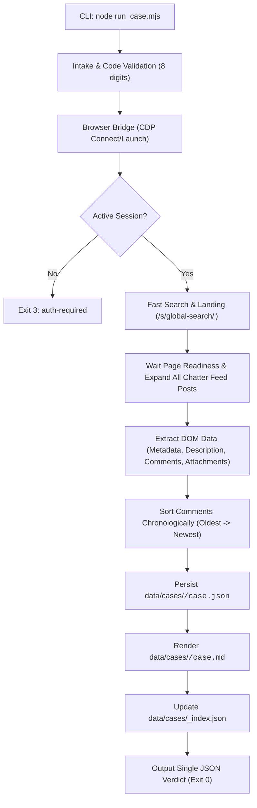

# PRD: Clean and Refactor Qualcomm Case Agent

## 1. Problem Statement
The current `qualcomm-case-agent` skill has accumulated non-core responsibilities including local LLM offline enrichment (`enrich_local.mjs`), background schedulers (`scheduler.mjs`, `register_task.ps1`), web dashboards (`web/`), and multiple output formats (`case.report.md`, `case.pdf`, `case.html`). This creates architectural bloat, adds brittle dependencies, slows down execution, and dilutes the core purpose of the skill.

The core and sole mission of `qualcomm-case-agent` must be strictly scoped to:
1. Handling authentication / session check with Qualcomm Support portal.
2. Fast searching and navigating to a target Qualcomm case code (8 digits).
3. Extracting the complete case information (metadata, description, attachments, and all Chatter feed comments).
4. Sorting comments strictly in chronological order (Oldest -> Newest) to provide an accurate timeline of the case.
5. Persisting the clean output to `case.json` and human-readable `case.md`, and updating `_index.json`.
6. Returning a single JSON verdict line via a minimal CLI contract (`node run_case.mjs <CODE>`).

---

## 2. Solution Architecture
A streamlined, deterministic pipeline running in the local workspace via Chrome DevTools Protocol (CDP):

### Key Architectural Decisions
- **Minimal CLI**: `node .claude/skills/qualcomm-case-agent/scripts/run_case.mjs <CODE>` without unnecessary flags.
- **Output Artifacts**:
  - `data/cases/<CODE>/case.json`: Pure structured case data with chronological comments array.
  - `data/cases/<CODE>/case.md`: Clean Markdown document featuring case metadata, initial description, and chronological comment timeline.
  - `data/cases/_index.json`: Global index updated with the case capture timestamp, subject, and comment count.
- **Chronological Sorting**: Extracted comments are normalized with parsed ISO timestamps and sorted strictly from oldest to newest.
- **Removed Modules & Features**:
  - `enrich_local.mjs` & LLM enrichment logic / prompts.
  - `scheduler.mjs`, `register_task.ps1`, `watchlist.json`.
  - `web/` dashboard files and dependencies.
  - `case.report.md`, `case.pdf`, `case.html`, `case.txt` rendering.

---

## 3. User Stories & Definition of Done (DoD)

### US-1: Minimal CLI & Intake Validation
- **As a** developer or agent,
- **I want to** run `node run_case.mjs <CODE>` with an 8-digit case code,
- **So that** the system validates input, resolves paths, and handles cache status automatically without superfluous CLI flags.
- **DoD**:
  - Accepts `<CODE>` (with or without `CASE-` prefix).
  - Rejects invalid formats immediately with exit code `1` and JSON error verdict.
  - No `--enrich` or `--no-pdf` flags present in CLI argument parser.

### US-2: Fast Auth & Landing
- **As a** user,
- **I want** the agent to connect to persistent Chrome and navigate directly to the case,
- **So that** execution is fast and authentication lapses are cleanly reported.
- **DoD**:
  - Detects if login is required; exits cleanly with code `3` and status `auth-required` if not logged in.
  - Successfully navigates to the target case via cached URL or search result.

### US-3: Complete Case Extraction & Chronological Sorting
- **As an** engineer,
- **I want** the case description and all Chatter comments extracted and sorted chronologically (Oldest -> Newest),
- **So that** I can read the complete case progression in chronological sequence.
- **DoD**:
  - All posts, comments, timestamps, author details, and attachments are captured.
  - Comments array in `case.json` and timeline in `case.md` are ordered from oldest timestamp to newest timestamp.

### US-4: Clean Output Persistence
- **As a** system,
- **I want** to write only `case.json` and `case.md` in `data/cases/<CODE>/`,
- **So that** the cache is lightweight, fast, and contains zero dead formats.
- **DoD**:
  - Only `case.json` and `case.md` are generated per case.
  - No PDF, HTML, or `case.report.md` are generated.
  - `data/cases/_index.json` is updated accurately.

### US-5: Dead Code & Dependency Purge
- **As a** maintainer,
- **I want** all unused enrichment, scheduler, dashboard, and dead documentation files deleted,
- **So that** the codebase remains lean, clean, and easily maintainable.
- **DoD**:
  - Deleted: `enrich_local.mjs`, `scheduler.mjs`, `register_task.ps1`, `web/`, `docs/LOCAL_LLM.md`, `docs/AUTOMATION.md`.
  - Updated: `SKILL.md`, `render_case.mjs`, `scrape_case.mjs`, `run_case.mjs`, `package.json` to remove dead references.

---

## 4. Deep Modules Map

| Module / File | Change | Description |
|---|---|---|
| `.claude/skills/qualcomm-case-agent/scripts/run_case.mjs` | **MODIFY** | Simplify orchestrator: strip `--enrich`, `--no-pdf`, remove LLM calls, output minimal verdict. |
| `.claude/skills/qualcomm-case-agent/scripts/scrape_case.mjs` | **MODIFY** | Enforce chronological sorting (Oldest -> Newest) on extracted comments, write `case.json`, update `_index.json`, trigger `render_case.mjs`. |
| `.claude/skills/qualcomm-case-agent/scripts/render_case.mjs` | **MODIFY** | Simplify to render ONLY `case.md` (metadata + description + chronological comments). Remove HTML/PDF/report.md generation. |
| `.claude/skills/qualcomm-case-agent/scripts/verify_case.mjs` | **MODIFY** | Adjust verification checks to only expect `case.json` and `case.md`. |
| `.claude/skills/qualcomm-case-agent/SKILL.md` | **MODIFY** | Update skill documentation to reflect strict search/extraction/chronological timeline role. |
| `.claude/skills/qualcomm-case-agent/scripts/enrich_local.mjs` | **DELETE** | Remove local LLM enrichment script. |
| `.claude/skills/qualcomm-case-agent/scripts/scheduler.mjs` | **DELETE** | Remove scheduler script. |
| `.claude/skills/qualcomm-case-agent/scripts/register_task.ps1` | **DELETE** | Remove scheduled task registration script. |
| `web/` | **DELETE** | Remove web dashboard directory. |
| `docs/LOCAL_LLM.md` | **DELETE** | Remove obsolete local LLM documentation. |
| `docs/AUTOMATION.md` | **DELETE** | Remove obsolete scheduler/automation documentation. |

---

## 5. Testing Decisions
1. **Unit & Integration Tests** (using Node test runner):
   - `tests/intake.test.mjs`: Test minimal CLI argument parsing and code validation.
   - `tests/chronological_sort.test.mjs`: Test comment normalization and strict oldest-to-newest timestamp sorting.
   - `tests/render_case.test.mjs`: Test that `render_case.mjs` outputs clean `case.md` with description & timeline, and does NOT generate PDF/HTML/report.md.
   - `tests/scrape_case.test.mjs`: Test cache persistence, index updating, and verification gates.
2. **Regression / End-to-End Testing**:
   - Run verification across mock case structures and existing tests (`npm test`).
   - Validate that all existing passing test suites continue to pass.

---

## 6. Out of Scope
- Any LLM-based post-processing, enrichment, or prompt engineering.
- Background cron/scheduler daemons or Windows Task Scheduler automation.
- Multi-case dashboards or web servers.
- PDF generation (Puppeteer/Chrome PDF print).
- Automated ticket sync / JIRA export (handled by separate skill if needed).
