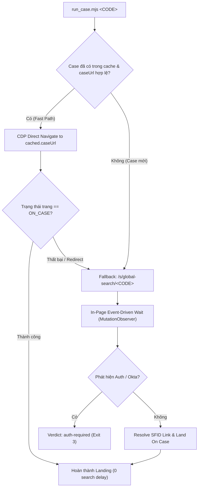

# PRD & Technical Spec: Fast CDP Case Search & Landing Engine

- **Feature Name**: `fast-case-search-landing`
- **Target Component**: `qualcomm-case-agent` (Search, Navigation, and Browser Automation Layer)
- **Status**: Ready for TDD Implementation
- **Author**: Antigravity & User Alignment Session

---

## 1. Problem Statement

Khi kích hoạt Agent Skill `qualcomm-case-agent` để tra cứu hoặc cập nhật một case Qualcomm (ví dụ: `08603854`), bước khởi đầu — **Search & Landing trên Salesforce Portal** — hiện đang gặp phải các điểm nghẽn nghiêm trọng về độ trễ (latency) và tài nguyên hệ thống:

1. **Child Process Spawn Overhead**: Mỗi lần thực hiện tương tác trình duyệt (`open`, `evalFile`, `click`), hệ thống phải spawn một tiến trình con mới thông qua `agent-browser` CLI (`child_process.execFileSync`). Trên môi trường Windows, việc spawn 10–20 tiến trình cho một lần search & land tiêu tốn từ 2.5s đến 5s chỉ riêng cho chi phí khởi tạo process của hệ điều hành.
2. **Fixed Sleep Polling Latency**: Quá trình chờ trang Salesforce Lightning hydrate và resolve URL (`pollReadiness`, `findCaseLink`, `landOnCase`) đang sử dụng các vòng lặp `sleep(2000ms)` và `sleep(600ms)` cố định từ phía Node. Điều này gây lãng phí thời gian chờ đợi thụ động ngay cả khi DOM đã sẵn sàng chỉ sau 100–300ms.
3. **Redundant Search on Known Cases**: Đối với các case đã từng được cào dữ liệu và lưu trong cache (`data/cases/<CODE>/case.json` hoặc `_index.json`), hệ thống vẫn luôn thực hiện tìm kiếm toàn cục `/s/global-search/<CODE>` rồi mới điều hướng, gây lãng phí 3–8s không cần thiết.
4. **Token Consumption Overhead**: Nếu agent phải lặp lại nhiều lượt rà soát hoặc in log quá nhiều trong giai đoạn intake/search, context token sẽ bị tiêu hao không cần thiết.

---

## 2. Solution

Xây dựng hệ thống **Fast CDP Search & Landing Engine** tối ưu tốc độ và loại bỏ token lãng phí dựa trên 3 trụ cột kiến trúc:

1. **Direct Native WebSocket CDP Client**: Sử dụng `WebSocket` native của Node.js (hỗ trợ sẵn từ Node 22, không cài đặt thêm package ngoài) để kết nối trực tiếp đến Chrome DevTools Protocol (CDP port 9222). Thực thi lệnh (`Page.navigate`, `Runtime.evaluate`, `Input.dispatchMouseEvent`) theo cơ chế persistent connection với độ trễ sub-millisecond (< 5ms).
2. **In-Page Event-Driven Wait (MutationObserver + Fast Poll)**: Thay thế toàn bộ vòng lặp `sleep(2000)` bằng async in-page wait script được thực thi qua `Runtime.evaluate({ awaitPromise: true })`. Sử dụng `MutationObserver` kết hợp fast interval (50–100ms) trong ngữ cảnh trình duyệt, trả về kết quả ngay lập tức khi DOM ready hoặc khi phát hiện chuyển hướng trang Auth/Okta.
3. **Direct Navigation with Smart Fallback**:
   - *Fast Path*: Nếu case đã tồn tại trong local cache/index và có `caseUrl`, điều hướng thẳng đến `caseUrl`. Nếu trạng thái trang là `ON_CASE`, hoàn thành bước landing chỉ trong 1 bước duy nhất (< 1s).
   - *Fallback Path*: Nếu URL lỗi thời, phiên hết hạn hoặc là case mới chưa có trong cache, tự động chuyển về `/s/global-search/<CODE>`, bóc tách link SFID và điều hướng tin cậy.



---

## 3. User Stories / Definition of Done (DoD)

Mỗi User Story đại diện cho một tiêu chí nghiệm thu độc lập và có thể kiểm thử tự động (testable acceptance criteria):

### **US-1: Direct CDP Persistent Connection**
- **Là một** hệ thống capture case,
- **Tôi muốn** kết nối trực tiếp với Chrome CDP port 9222 qua persistent WebSocket,
- **Để** loại bỏ hoàn toàn việc spawn `agent-browser.cmd` CLI nhiều lần.
- **DoD / Acceptance Criteria**:
  - Gửi lệnh `Runtime.evaluate`, `Page.navigate` và nhận kết quả trong < 10ms.
  - Tự động reconnect nếu connection bị ngắt quãng hoặc Chrome restart.
  - Không sinh ra bất kỳ tiến trình con (child process) nào cho các thao tác eval DOM.

### **US-2: Direct Navigation for Cached Cases**
- **Là một** kỹ sư cần cập nhật case (`--mode update` hoặc `auto`),
- **Tôi muốn** hệ thống nhảy thẳng vào `caseUrl` đã lưu trong cache,
- **Để** tiết kiệm 3–8 giây tìm kiếm trên portal.
- **DoD / Acceptance Criteria**:
  - Khi có `cached.caseUrl`, điều hướng thẳng đến URL đó và kiểm tra trạng thái `ON_CASE`.
  - Nếu thành công, bỏ qua bước gọi search và trả về `state: 'OK'`, `href: caseUrl`.

### **US-3: Resilient Fallback on Invalid or New Case URLs**
- **Là một** hệ thống cào dữ liệu,
- **Tôi muốn** tự động fallback về `/s/global-search/<CODE>` khi direct navigation thất bại hoặc khi case chưa từng được cào,
- **Để** đảm bảo tính chính xác 100% không bao giờ bị kẹt do URL hỏng.
- **DoD / Acceptance Criteria**:
  - Khi direct navigation rơi vào trang 404, search stub hoặc redirect, hệ thống tự động gọi search `/s/global-search/<CODE>`.
  - Bóc tách đầy đủ metadata (Title, Status, Priority, Severity) từ bảng kết quả search row.

### **US-4: In-Page Event-Driven DOM Hydration**
- **Là một** module navigation,
- **Tôi muốn** trang tự thông báo khi các phần tử Lightning hoàn tất hydrate thông qua `MutationObserver`,
- **Để** không phải đợi các khoảng `sleep(2000ms)` cứng nhắc.
- **DoD / Acceptance Criteria**:
  - Thời gian phản hồi trạng thái `READY` hoặc `FOUND` < 300ms đối với trang đã tải xong.
  - Nhận biết ngay lập tức trạng thái `AUTH` (chuyển hướng Okta SSO) mà không chờ hết timeout.
  - Giới hạn cứng timeout an toàn tối đa 10s (tránh treo vô hạn nếu portal đổi DOM).

### **US-5: Zero-Token & Deterministic Execution**
- **Là một** AI Agent (Claude Code / Antigravity),
- **Tôi muốn** chạy lệnh `run_case.mjs` với output verdict 1 dòng JSON duy nhất,
- **Để** tiêu tốn 0 model tokens cho quá trình search và landing.
- **DoD / Acceptance Criteria**:
  - stdout chỉ chứa duy nhất 1 JSON line biểu diễn verdict (`status`, `code`, `caseUrl`, `timing`).
  - Log chi tiết đẩy ra stderr, không làm ô nhiễm context token của model.

---

## 4. Deep Modules Map

Thiết kế các module theo triết lý **Deep Modules** (Giao diện công khai cực kỳ đơn giản và trực quan, ẩn giấu toàn bộ logic phức tạp về giao thức CDP, websocket buffering, và retry bên trong):

```
.claude/skills/qualcomm-case-agent/scripts/
├── cdp_client.mjs        # [NEW] Deep Module: Quản lý WebSocket CDP kết nối Chrome 9222
├── fast_landing.mjs      # [NEW] Deep Module: Direct Nav + Event-driven search & landing logic
├── browser.mjs           # [MODIFY] Tích hợp cdp_client làm transport chính (fallback CLI nếu cần)
├── run_case.mjs          # [MODIFY] Chuyển đổi landOnCase sang fast_landing engine
```

### 1. `cdp_client.mjs` (Deep Module)
- **Public Interface**:
  ```javascript
  export class CdpClient {
    static async connect(options = { port: 9222, host: '127.0.0.1' }): Promise<CdpClient>
    async navigate(url: string): Promise<{ state: string, url: string }>
    async eval(expression: string, args?: Record<string, any>, awaitPromise?: boolean): Promise<any>
    async click(selector: string): Promise<boolean>
    async close(): Promise<void>
  }
  ```
- **Encapsulated Complexity**:
  - Quản lý vòng đời WebSocket, parsing CDP JSON-RPC format (`id`, `method`, `params`, `result`).
  - Xử lý auto-reconnect, target discovery từ `http://127.0.0.1:9222/json/list`.
  - Tự động serialize/deserialize tham số vào context `Runtime.evaluate`.

### 2. `fast_landing.mjs` (Deep Module)
- **Public Interface**:
  ```javascript
  export async function fastLandOnCase(
    code: string,
    options: {
      cdp: CdpClient,
      cached?: { caseUrl?: string, title?: string },
      portalUrl?: string
    }
  ): Promise<{
    state: 'OK' | 'AUTH' | 'NOT_FOUND' | 'BLOCKED' | 'STUB',
    href: string,
    fields: Record<string, string>,
    fastPathUsed: boolean,
    durationMs: number
  }>
  ```
- **Encapsulated Complexity**:
  - Kiểm tra tính hợp lệ của `cached.caseUrl` và thực hiện fast-path navigation.
  - Tự động chạy in-page `MutationObserver` chờ Lightning resolve SFID.
  - Xử lý xóa `target="_blank"`, gán `data-cq-hit`, dispatch trusted click và kiểm tra `STUB_PATH_RE`.
  - Đo lường và báo cáo metric thời gian hoàn thành (timing metrics).

---

## 5. Testing Decisions (TDD Strategy)

Để áp dụng triệt để quy trình TDD (**Red 🔴 -> Green 🟢 -> Refactor 🔵**), chiến lược kiểm thử được phân định rõ ràng thành 2 tầng:

### A. Mock CDP Server (CI & Unit Testing - Siêu nhanh < 100ms)
- **Vị trí**: `tests/mocks/cdp_server.mjs`
- **Cơ chế**: Tạo một lightweight HTTP/WebSocket Server cục bộ trong Node.js (dùng `node:http` và native WebSocket):
  - Giả lập endpoint `http://127.0.0.1:TEST_PORT/json/list` trả về danh sách page targets.
  - Xử lý các frame WebSocket CDP:
    - Nhận `Page.navigate` -> Trả về `{ frameId: '...' }`.
    - Nhận `Runtime.evaluate` -> Thực thi callback mock tương ứng với biểu thức JS (mô phỏng DOM states: `READY`, `ON_CASE`, `AUTH`, `FOUND`, `STUB`).
- **Test Files**:
  1. `tests/cdp_client.test.mjs`: Test kết nối, gửi lệnh eval, handle disconnect/timeout, serialization.
  2. `tests/fast_landing.test.mjs`:
     - Test Fast Path (direct nav khi có `cached.caseUrl`).
     - Test Fallback Path khi `cached.caseUrl` trả về 404/STUB.
     - Test New Case search & SFID resolution.
     - Test Auth Session Lapsed (Okta redirect).
     - Test Not Found / Empty search result.

### B. E2E Smoke Test Script (Manual / Pre-release Verification)
- **Vị trí**: `tests/e2e_landing_smoke.mjs`
- **Mục đích**: Chạy thử nghiệm thực tế trên Chrome thật đang mở cổng 9222 với 1 case thật để kiểm tra tính tương thích DOM thực tế của Salesforce.

---

## 6. Out of Scope

Để giữ ranh giới tính năng rõ ràng, tập trung giải quyết triệt để bài toán Search & Landing, các phần sau **KHÔNG** nằm trong phạm vi của đợt triển khai này:

1. **Thay đổi cấu trúc phân tích LLM (Enrichment Logic)**: Giữ nguyên logic gọi Local LLM (`enrich_local.mjs`) và prompt kỹ thuật 3GPP/Protocol.
2. **Thay đổi định dạng Report / Export Artifacts**: Giữ nguyên toàn bộ engine sinh Markdown, HTML, TXT, PDF trong `render_case.mjs`.
3. **Thay đổi cơ chế lưu trữ Cache**: Cấu trúc thư mục `data/cases/<CODE>/` và schema `case.json` được giữ nguyên 100% để đảm bảo tương thích ngược.
4. **Viết lại giao diện Web Dashboard**: Không thay đổi UI của `web/server.mjs`.
